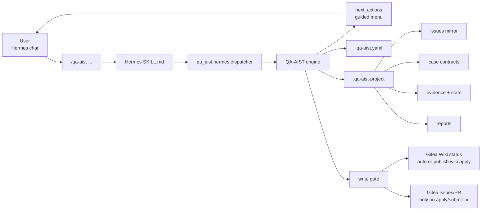
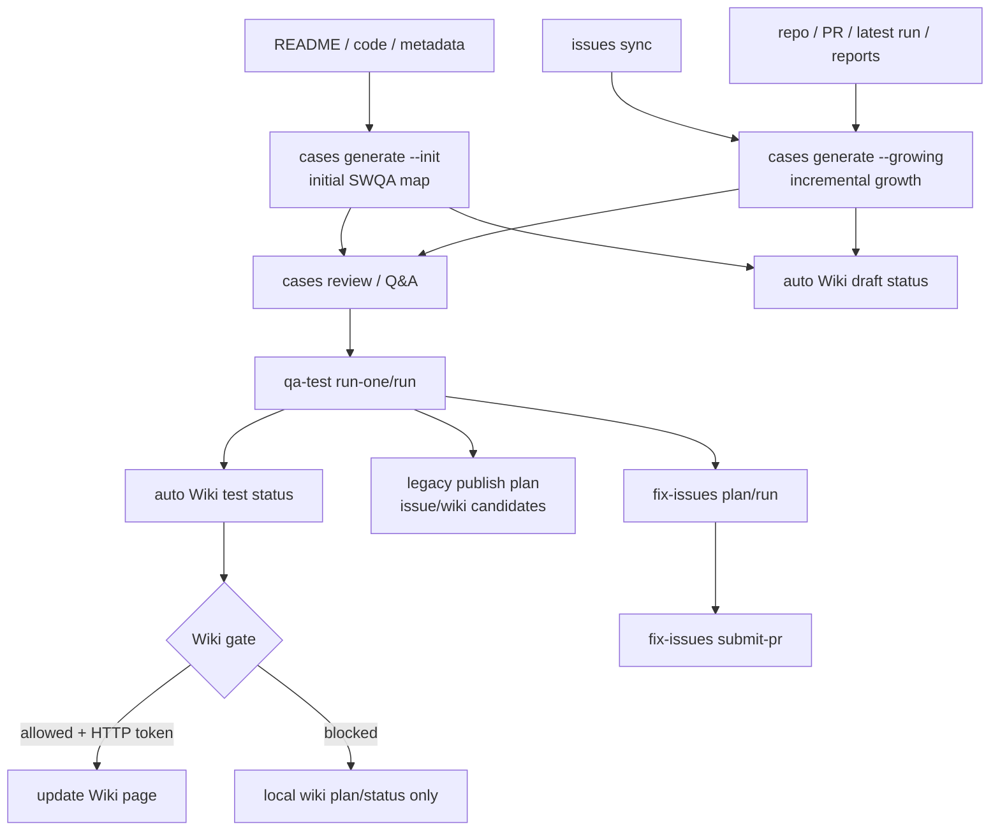

# QA-AIST


QA-AIST 是給 Hermes 使用的開源 SWQA lifecycle agent/plugin。使用者在 Hermes 聊天室輸入 `/qa-aist ...`，Hermes 依 `SKILL.md` 呼叫 QA-AIST engine，同步 Gitea issues、產生 test cases、執行測試、保存 evidence、自動更新 Gitea Wiki 狀態看板，並在明確 apply/submit-pr 後才寫 issue 或 PR。

English summary: QA-AIST is a Hermes-first deterministic QA lifecycle engine for Gitea issue sync, test-case generation, evidence-based test execution, automatic gated Wiki status sync, and PR handoff.

## What Is QA-AIST?

QA-AIST 把 SWQA 流程固定成一條可重跑、可審計的 pipeline：issue sync -> case generation -> qa-test -> publish gate -> fix/PR。Hermes 可以協助問答和修碼，但不能自己跳過 QA-AIST 的 sync、contract、evidence、write gate 或 duplicate checks。

目前整合方式是 **Hermes dynamic skill**：Hermes 會掃描 `~/.hermes/skills/qa-aist/SKILL.md`，再由 agent 依 skill 指示執行 QA-AIST dispatcher。這不是 native Hermes router；如果你要 LLM 前置的 deterministic slash command，需要另外接 Hermes router/plugin。

## How It Works





## 5-minute Quick Start

假設 QA-AIST source checkout 在 `/root/repo/QA-AIST`，產品 repo 在 `/path/to/your-product`。

1. 安裝 Hermes skill：

```bash
cd /root/repo/QA-AIST
PYTHONPATH=/root/repo/QA-AIST/src python3 -m qa_aist.hermes install-skill --force \
  --runner-command "/usr/bin/env PYTHONPATH=/root/repo/QA-AIST/src python3 -m qa_aist.hermes"
```

2. 在 Hermes 聊天室重掃 skills：

```text
/reload-skills
```

3. 在產品 repo 的 Hermes session 輸入：

```text
/qa-aist help
/qa-aist setup
/qa-aist doctor
```

4. 檢查 setup 結果。

如果產品 repo 已有 `git remote origin`，`/qa-aist setup` 會自動推導 Gitea 設定，預設使用 Hermes-friendly MCP read backend：

```text
tracker_setup: gitea/mcp
gitea_repo: owner/repo
auto_configured_mcp: true
```

這代表 `.qa-aist.yaml` 已經有：

```yaml
tracker:
  provider: gitea
  gitea:
    backend: mcp
    base_url: "https://git.example.com"
    repo: "owner/repo"
    mcp_issues_json: .qa-aist-project/state/gitea-mcp/issues.json
```

接著 Hermes 只需要在你確認後用 Gitea MCP 讀 issues，寫入 `mcp_issues_json`，再執行 `/qa-aist issues sync`。

5. 需要手動覆寫時才改 `.qa-aist.yaml` 或使用 setup flags。

如果你要讓 QA-AIST 直接用 Gitea REST API 同步 issues、在 gate 通過後自動更新 Wiki，並允許明確 `publish apply` / `submit-pr`，用 HTTP backend，token 只放 env：

```yaml
tracker:
  provider: gitea
  gitea:
    backend: http
    base_url: "https://git.example.com"
    repo: "owner/repo"
    token_env: QA_AIST_GITEA_TOKEN
    wiki_page: "Test status (Siri)"
    branch_prefix: "qa-aist/issue-"
```

如果你的 Hermes 已經有 Gitea MCP，QA-AIST 也支援 read-only MCP issue sync：Hermes 先用 Gitea MCP 讀 issues，將原始 JSON 寫入 `mcp_issues_json`，再呼叫 `/qa-aist issues sync`。這條路不需要 token，但只支援同步，不支援遠端寫入。

```yaml
tracker:
  provider: gitea
  gitea:
    backend: mcp
    repo: "owner/repo"
    mcp_issues_json: .qa-aist-project/state/gitea-mcp/issues.json
```

6. 跑完整新手流程：

```text
/qa-aist issues sync
/qa-aist issues dedupe
/qa-aist cases generate --init
/qa-aist cases review
/qa-aist cases validate
/qa-aist qa-test list
/qa-aist qa-test run-one <case_id>
/qa-aist publish wiki status
/qa-aist publish wiki plan
/qa-aist publish wiki apply
```

`/qa-aist cases generate` 不會默默猜模式。首次導入請用 `/qa-aist cases generate --init`，它會像有主見的 SWQA 工程師一樣分析 README、程式碼、package metadata、既有 runners/cases/rules，先建立「基本都要測」的初始測試地圖，涵蓋功能、正向、反向、邊界、invalid input、side-effect-safe、壓力/timeout 等 draft cases。後續有新 issues、PR、latest run 或 reports 時，才用 `/qa-aist cases generate --growing`，像蜘蛛網一樣從最新狀態擴散新的測試假說。若 payload 回傳 `hermes_needs_input`，Hermes 必須呼叫 `clarify` 逐題補齊少量阻擋執行的資訊，例如安全測試入口、fixture/lab target 與不可碰範圍。

`--init` 預設不套任意數量上限；它會依 repo 掃描到的 surfaces 與固定 SWQA 維度產生完整初始地圖。`--count <max>` 只用在你刻意想縮小第一批 exploratory draft 時。

## Guided Interaction

QA-AIST 的 Hermes skill 不是被動轉貼 JSON。每次 `/qa-aist ...` 執行後，engine 會回傳 `next_actions`，Hermes 應該用繁體中文列出下一步選單，讓使用者回覆編號或直接輸入下一個指令。

如果 engine 回傳 `payload.input_required: true`、`payload.interaction.type: "needs_input"` 或 `payload.hermes_needs_input.status: "required"`，Hermes 應呼叫 `clarify`。`payload.hermes_needs_input.questions[]` 是唯一標準題目來源；`clarify` 不可用時，才在聊天室列出題目並等待使用者回答。

範例：

```text
qa-aist> OK
         open_issues: 3

下一步可以選：
1. 檢查重複 issue：/qa-aist issues dedupe
2. 首次建立 SWQA cases：/qa-aist cases generate --init（需確認）
3. 查看 issue sync 狀態：/qa-aist issues status

請回覆選項編號，或直接輸入下一個 /qa-aist ... 指令。
```

互動原則：

- 安全的查詢類指令，例如 `status`、`doctor`、`issues status`、`qa-test list`，Hermes 可以主動提議立即執行。
- `status` 和 `doctor` 會提前檢查 issue sync readiness；如果 Gitea/MCP/token/snapshot 尚未準備好，會先顯示 blocker，不必等到 `issues sync` 才失敗。
- 會寫檔、跑測試、讀 Gitea MCP、publish、push branch、建立 PR 的動作，Hermes 必須先問使用者確認。
- `cases generate --init` 或 `cases generate --growing` 若產生 `hermes_needs_input`，Hermes 要逐題呼叫 `clarify` 補齊，不要亂猜；`review_required_before_run` 的 draft 會被 engine 擋成 `BLOCK`，不會直接執行。
- `cases generate --init/--growing`、`qa-test run-one/run`、`close-loop run-once` 後，QA-AIST 會自動產生 Wiki 狀態 plan；如果 Gitea HTTP token、backend、gate 都通過，會只更新 Wiki 頁。
- `publish wiki apply`、`publish apply` 和 `fix-issues submit-pr` 前，Hermes 必須摘要將寫入的目標與 gate 結果。

## Command Cheat Sheet

| 你想做的事 | Hermes command | 說明 |
|---|---|---|
| 看中文手冊 | `/qa-aist help` | 列出 workflow 與 topic help |
| 看 qa-test 教學 | `/qa-aist qa-test` 或 `/qa-aist help qa-test` | 解釋 case contract、run-one、evidence |
| 初始化產品 repo | `/qa-aist setup` | 建立 `.qa-aist.yaml` 與 `.qa-aist-project` |
| 健康檢查 | `/qa-aist doctor` | 檢查 config、paths、secret references |
| 同步 Gitea issues | `/qa-aist issues sync` | open issue 寫 mirror；closed issue 移出 active mirror |
| 看 issue 狀態 | `/qa-aist issues status` | 顯示 snapshot 與 mirror 數量 |
| 看單一 issue | `/qa-aist issues show <id>` | 印出本地 issue mirror |
| 檢查重複 issue | `/qa-aist issues dedupe` | 找疑似重複 active issue |
| 首次建立 SWQA cases | `/qa-aist cases generate --init` | 分析 README/code/metadata/runners/rules，產生功能、正向、反向、邊界、壓力 draft contract |
| 依最新狀態擴散 cases | `/qa-aist cases generate --growing` | 依 issues/PR/latest-run/reports/cases/runners 長出 incremental draft contract |
| 指定功能產生初始 cases | `/qa-aist cases generate --init --feature "CLI help" --profile cli` | 讓 QA-AIST 針對功能/profile 產生完整初始建案；`--count <max>` 只在你想手動縮小範圍時使用 |
| 匯入 growth session 候選 | `/qa-aist cases generate --growing --candidate-json <path>` | Hermes 獨立 session 只產候選 JSON，engine 驗證後才寫 case |
| 審查 draft | `/qa-aist cases review` | 顯示待問答問題 |
| 驗證 case YAML | `/qa-aist cases validate` | 確認可被 qa-test 讀取 |
| 列出測試 | `/qa-aist qa-test list` | 列出 case_id 與 commands |
| 預覽測試 | `/qa-aist qa-test dry-run` | 不執行，只產生 NOT_RUN result |
| 跑單一 case | `/qa-aist qa-test run-one <case_id>` | 最適合第一次除錯 |
| 跑全部 cases | `/qa-aist qa-test run` | 保存 stdout/stderr/rc/meta/result JSON |
| 查看 Wiki 同步 | `/qa-aist publish wiki status` | 看最新 Wiki plan/apply、blocked reason、page |
| 手動產生 Wiki plan | `/qa-aist publish wiki plan` | 只產生 Wiki-only gated plan |
| 手動更新 Wiki | `/qa-aist publish wiki apply` | gate 通過且 HTTP token 存在時只更新 Wiki |
| 本地 render Wiki | `/qa-aist publish wiki render` | 不碰遠端，只重寫 `wiki-status.md` |
| 相容舊發布計畫 | `/qa-aist publish plan` | 將 latest run 轉成 wiki/issues candidates 並跑 gate |
| 相容舊 Gitea 寫入 | `/qa-aist publish apply` | gate 全部通過且 token 存在才寫 wiki/issues |
| 修復前檢查 | `/qa-aist fix-issues plan --issue <id>` | 確認 sync、dedupe、open issue、case linkage |
| 修復 handoff | `/qa-aist fix-issues run --issue <id>` | 產生 Hermes 修碼 handoff |
| 建立 PR | `/qa-aist fix-issues submit-pr --issue <id>` | push branch 並用 Gitea API 建 PR |
| 報告 | `/qa-aist report status` | 產生 Markdown status report |

Legacy aliases:

| Legacy | Current |
|---|---|
| `/qa-aist sync-gitea pull` | `/qa-aist issues sync` |
| `/qa-aist sync-gitea status` | `/qa-aist issues status` |
| `/qa-aist find-new-issues run` | `/qa-aist publish plan` |
| `/qa-aist tracker plan-write` | 單一 write-gate 相容指令 |

## Project Layout

```text
your-product/
  .qa-aist.yaml
  .qa-aist-project/
    issues/       # Gitea open issue mirrors
    cases/        # YAML case contracts
    runners/      # project-specific runner scripts
    rules/        # SWQA rules copied from QA-AIST
    state/        # snapshots, latest-run.json, plans
      gitea-mcp/  # optional read-only MCP issue input snapshot
    evidence/     # stdout/stderr/rc/meta/result JSON
    reports/      # Markdown/JSON reports
```

`.qa-aist` 是工具本體；`.qa-aist-project` 是 host project runtime data。不要把 token、password、lab credentials、customer data 寫進 tool source 或 tracked config。

## Built-in SWQA Policy Pack

QA-AIST 內建的 closed-loop 思維來自舊 `.qa-project/.../docs/policies` 的精華，但已正規化成通用 policy pack，不把 irctool、Redfish、VM fixture 等專案特化內容寫進 core。

```text
Observe -> Normalize -> Execute -> Triage -> Publish -> Evolve -> Prune
```

`/qa-aist cases generate --init` 會用這個 policy pack 建立少量高價值初始 draft cases，預設覆蓋功能、正向、反向、邊界、壓力/timeout 與 side-effect-safe 風險。`/qa-aist cases generate --growing` 則在後續依最新 issues/PR/run/report 狀態擴散：

| Dimension | Purpose |
|---|---|
| exact reproduction | 有 issue 時先鎖定可重現路徑 |
| functional | 使用者可見功能應可被驗證 |
| positive | 主路徑應成功 |
| negative | 錯誤用法應清楚拒絕 |
| boundary | 空值、最小值、最大值、重複值等 |
| invalid input | 不合法參數、格式、狀態 |
| sibling surface | 相鄰 command/API/mode 是否同樣安全 |
| side-effect-safe | 優先 dry-run、mock、parser-only、no-op fixture |
| stress/timeout-risk | 大量、慢速、timeout 類結果需 baseline 後才 filing |

## Case Contract

最小 contract：

```yaml
case_id: CLI-HELP-001
title: CLI help can be rendered
source:
  provider: gitea
  issue_id: 123
commands:
  - id: help
    run: python3 -m your_package --help
    expected_exit_code: 0
```

必填欄位：

| Field | Required | Meaning |
|---|---:|---|
| `case_id` | yes | Stable test id |
| `title` | yes | Human-readable title |
| `commands[].id` | yes | Stable command id |
| `commands[].run` | yes | Shell command or runner path |
| `commands[].expected_exit_code` | yes | Expected return code |

`cases generate --init` 會產生 `source.type: init` 的初始 draft，固定涵蓋 functional、positive、negative、boundary、invalid input、side-effect-safe、stress/timeout-risk 等 SWQA 維度。`cases generate --growing` 會產生 `source.type: growth` 的增量 draft，附 `growth_seed`、`six_hats`、`growth_reason` 與 `qa_aist.questions`。Hermes 要先問使用者並補齊測試需要的 runner、fixture、輸入檔、環境變數、成功條件、side-effect safe 邊界，再跑正式測試。若 draft 標示 `review_required_before_run: true`，正式 `qa-test run` 會回 `BLOCK`。

## Reports And Evidence

每次 `qa-test` 會產生：

- `<command>.stdout.log`
- `<command>.stderr.log`
- `<command>.rc`
- `<command>.meta`
- `result.json`

Normalized result 固定包含 `case_id`、`status`、`commands`、`evidence`、`contract_hash`、`started_at`、`ended_at`、`exit_code`。`close-loop run-once` 會寫 `.qa-aist-project/state/latest-run.json`，`report status` 會寫 `.qa-aist-project/reports/status.md`。

## Wiki Status Board

Gitea Wiki 是 QA-AIST 的預設狀態看板。預設頁名是 `Test status (Siri)`，由 `.qa-aist.yaml` 的 `tracker.gitea.wiki_page` 控制。

自動同步時機：

| Event | Wiki gate mode | Behavior |
|---|---|---|
| `cases generate --init/--growing` | `case_generation` | 更新 draft case、missing input、六色帽摘要；可沒有 test evidence，但不宣稱 PASS/FAIL |
| `qa-test run-one/run` | `test_result` | 更新測試結果；必須有 latest run 與 current evidence |
| `close-loop run-once` | `test_result` | 更新完整 pipeline 後的測試狀態 |
| `publish apply` / `fix-issues submit-pr` 成功後 | `gitea_write_summary` | 最後補上剛完成的 Gitea 寫入摘要 |

手動指令：

```text
/qa-aist publish wiki status
/qa-aist publish wiki render
/qa-aist publish wiki plan
/qa-aist publish wiki apply
```

自動寫入規則很嚴格：只有 `tracker.provider: gitea`、`tracker.gitea.backend: http`、token env 存在、Wiki gate 通過時，QA-AIST 才會更新遠端 Wiki。若 tracker disabled、MCP backend、token missing 或 gate blocked，只會寫本地：

```text
.qa-aist-project/state/wiki-plan.json
.qa-aist-project/state/wiki-apply-result.json
.qa-aist-project/reports/wiki-status.md
```

Wiki renderer 的固定目錄：

```text
# Test status (Siri)
## 總覽
## 測試結果明細
### <dynamic category>
## 補充 partial probes（不併入正式 case counters）
## 活動中的 Gitea issues
## 已關閉／歷史 issues（不列 active blocker）
## 六色帽回顧
```

分類不是 core 寫死。`/qa-aist setup` 會建立 `.qa-aist-project/rules/wiki-categories.yaml`，你可以用 `wiki.category`、case `feature`、issue label、title/command keyword 調整分類。

## Write Gate

QA-AIST 可以真實寫 Gitea，但只允許明確的 apply/submit-pr 流程：

| Gate condition | Result |
|---|---|
| closed issue write | blocked |
| duplicate issue candidate | blocked |
| stale or missing issue sync | blocked |
| contract drift | blocked |
| missing/current evidence | blocked |
| raw secret leakage | blocked |
| modifying another user's post | blocked |
| internal `.qa/`, run internals, prompt text leakage | blocked |
| tracker disabled or token missing | blocked |
| `tracker.gitea.backend: mcp` remote write | blocked |

Hermes 不可以自己組 Gitea comment、issue、wiki 或 PR API request。需要遠端寫入時，只能走：

```text
/qa-aist publish wiki apply
/qa-aist publish plan
/qa-aist publish apply
/qa-aist fix-issues submit-pr --issue <id>
```

`publish wiki apply` 只更新 Wiki，不會建立 issue comment、new issue 或 PR。

## What This Is Not

- QA-AIST 不是讓 Hermes 任意拼 shell command 或 tracker action 的捷徑。
- QA-AIST 不會自動 reopen closed issues。
- QA-AIST 不會修改不是目前 actor 自己張貼的 Gitea post。
- QA-AIST 不會在沒有 sync、evidence、contract hash、write gate 的情況下寫遠端。
- QA-AIST 不是 native Hermes router；目前是 dynamic skill mediated flow。

## Developer / CI Usage

Hermes 背後使用同一個 deterministic engine。CI 或本機除錯可以直接跑：

```bash
PYTHONPATH=src python3 -m qa_aist.cli init-project --root /path/to/product
PYTHONPATH=src python3 -m qa_aist.cli init-project --root /path/to/product --tracker-provider gitea --gitea-backend mcp --gitea-base-url https://git.example.com --gitea-repo owner/repo
PYTHONPATH=src python3 -m qa_aist.cli issues sync --root /path/to/product --issues-json issues.json
PYTHONPATH=src python3 -m qa_aist.cli cases generate --root /path/to/product --init --feature "CLI help" --profile cli
PYTHONPATH=src python3 -m qa_aist.cli cases generate --root /path/to/product --growing --candidate-json growth-candidates.json
PYTHONPATH=src python3 -m qa_aist.cli qa-test run-one --root /path/to/product ISSUE-1
PYTHONPATH=src python3 -m qa_aist.cli publish wiki status --root /path/to/product
PYTHONPATH=src python3 -m qa_aist.cli publish wiki plan --root /path/to/product
PYTHONPATH=src python3 -m qa_aist.cli publish wiki apply --root /path/to/product
PYTHONPATH=src python3 -m qa_aist.cli fix-issues submit-pr --root /path/to/product --issue 1 --dry-run
```

Run tests:

```bash
PYTHONPATH=src python3 -m unittest discover -s tests
```

## Security

- Store tokens in environment variables only, for example `QA_AIST_GITEA_TOKEN`.
- Do not paste raw secrets into `.qa-aist.yaml`, issue mirrors, case YAML, runner output, reports, PR bodies, or screenshots.
- If a secret leaks, revoke it first, then report through the project's security channel.

## Contributing

Issues and PRs are welcome. Good contributions include:

- provider adapters behind the existing write gate;
- test runners and contract examples;
- safer case generation templates;
- Hermes integration improvements;
- documentation that helps non-experts operate the lifecycle.

PRs should include tests for changed behavior and must not commit host project runtime data, credentials, customer data, or lab topology.

## Roadmap

- Gitea-first lifecycle hardening.
- Redmine/GitHub provider adapters.
- Native Hermes router/plugin integration.
- Richer SWQA case generation and review workflow.
- Wiki/report templates for different engineering audiences.

## FAQ

### Why does `/qa-aist qa-test` show help?

Because `qa-test` is a command group. Use `qa-test list`, `qa-test dry-run`, `qa-test run-one <case_id>`, or `qa-test run`.

### Why is `publish wiki apply` blocked?

Usually because Wiki gate blocked it, Gitea token env is missing, backend is MCP/read-only, evidence is missing for a test-result update, or tracker provider is disabled.

### Why is `publish apply` blocked?

Usually because write gate blocked it, Gitea token env is missing, issue sync is stale/missing, evidence is missing, or tracker provider is disabled.

If `.qa-aist.yaml` uses `tracker.gitea.backend: mcp`, `publish apply` and `fix-issues submit-pr` are intentionally blocked. MCP backend is read-only in V1 and only feeds `/qa-aist issues sync`. Use `backend: http` plus `QA_AIST_GITEA_TOKEN` for real remote writes.

### Why did `/qa-aist issues sync` ask for an MCP JSON snapshot?

Your config uses `tracker.gitea.backend: mcp`. Hermes must use the configured Gitea MCP read tool to fetch issues, write the raw issue list to `.qa-aist-project/state/gitea-mcp/issues.json` or the path named by `QA_AIST_GITEA_MCP_ISSUES_JSON`, then rerun `/qa-aist issues sync`.

### Why does `qa-aist-hermes` not exist?

That console script exists only after package installation. From a source checkout, use:

```bash
PYTHONPATH=/path/to/QA-AIST/src python3 -m qa_aist.hermes skill-status
```

### Can QA-AIST really write Gitea?

Yes. Wiki can be updated automatically or through `publish wiki apply` after the Wiki gate passes. Issue comments/issues require `publish apply`; PRs require `fix-issues submit-pr`. All remote writes require deterministic gates and `QA_AIST_GITEA_TOKEN`.
