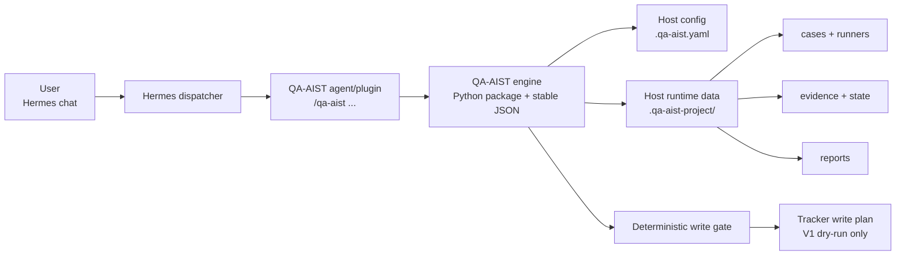
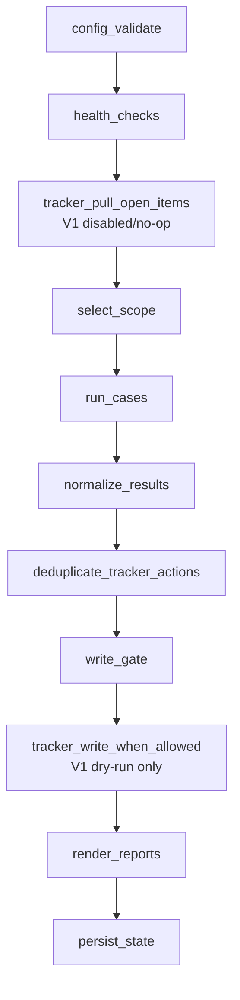
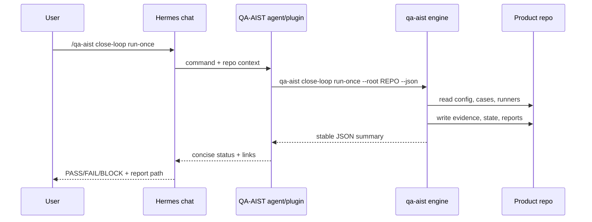

# QA-AIST


QA-AIST 是給 Hermes 使用的 QA agent/plugin：使用者在 Hermes 聊天視窗輸入 `/qa-aist ...`，QA-AIST 會初始化專案、驗證設定、執行測試 case、保存 evidence、產生 report，並在任何 tracker 動作前套用 deterministic write gate。

English summary: QA-AIST is a Hermes-first QA automation agent/plugin. Users operate it from Hermes chat with `/qa-aist ...`; the Python CLI package is the deterministic execution engine behind the agent and for CI/local debugging.

## What Is QA-AIST?

QA-AIST 把「測試怎麼跑、證據存哪裡、什麼時候可以寫 tracker」變成一條固定、可檢查、可重跑的流程。一般使用者不需要直接操作 Python package，也不需要自己判斷能不能留言、reopen 或 close issue；Hermes 只要把 `/qa-aist` 指令交給 QA-AIST engine，並把結果呈現在聊天室。

QA-AIST 適合導入到任何產品 repo。工具本體可以安裝、vendored 或由 Hermes 管理；產品專案自己的 config、cases、runners、evidence、reports 都固定放在 host repo 的 `.qa-aist-project`。

## Current Status

| Area | V1 status |
|---|---|
| Hermes command interface | `/qa-aist ...` as the public user-facing interface |
| Python CLI engine | Implemented as `qa-aist ...` for Hermes dispatch, CI, and local debugging |
| Case contracts | YAML ordered commands with deterministic contract hash |
| Evidence and reports | stdout, stderr, return code, metadata, result JSON, latest run JSON, Markdown report |
| Tracker writes | Dry-run plan only; no real tracker write in V1 |
| Write gate | Deterministic deny/allow checks before any future tracker write |

## How It Works



簡單講：

1. 你在 Hermes 聊天室輸入 `/qa-aist ...`。
2. Hermes 把指令交給 QA-AIST agent/plugin。
3. QA-AIST engine 讀取 `.qa-aist.yaml` 和 `.qa-aist-project`。
4. QA-AIST 按固定 pipeline 執行 case contract。
5. QA-AIST 產出 evidence、report、latest state。
6. 需要 tracker 動作時，先產生 gated write plan；V1 不會真的寫 tracker。

## Quick Start

下面的指令是在 Hermes 已經註冊 QA-AIST agent/plugin 後，輸入在 Hermes 聊天視窗，不是在 terminal。若 Hermes 還沒有註冊 `/qa-aist`，請先看 [Hermes Agent Installation](docs/HERMES_AGENT_INSTALL.md)；如果你在本機或 CI 直接呼叫 engine，請看後面的 Developer / CI Usage。

| Step | 在 Hermes 輸入 | 你會得到什麼 |
|---:|---|---|
| 1 | `/qa-aist setup` | 建立 `.qa-aist.yaml` 和 `.qa-aist-project` starter files |
| 2 | `/qa-aist doctor` | 檢查 config、workspace、paths、secret references |
| 3 | `/qa-aist qa-test list` | 列出目前可執行的 case contracts |
| 4 | `/qa-aist qa-test run-one EXAMPLE-001` | 執行單一 case 並保存 evidence |
| 5 | `/qa-aist close-loop run-once` | 跑完整 QA close-loop pipeline |
| 6 | `/qa-aist report status` | 產生或更新 Markdown status report |
| 7 | `/qa-aist tracker plan-write` | 只產生 tracker write plan，不真的寫 tracker |

聊天室裡的操作大概會像這樣：

```text
you> /qa-aist doctor
qa-aist> PASS
         config: .qa-aist.yaml
         cases: 1
         runners: 1
         secrets: env var names only, raw values hidden

you> /qa-aist qa-test run-one EXAMPLE-001
qa-aist> PASS
         result: .qa-aist-project/evidence/EXAMPLE-001/result.json
         report: run /qa-aist report status
```

## Command Cheat Sheet

這些是 README 保證描述的 V1 user-facing commands。`/qa-aist` 是 Hermes chat 指令；背後會對應到 `qa-aist` CLI engine。

| 你想做的事 | Hermes command | Notes |
|---|---|---|
| 初始化或更新 QA-AIST workspace | `/qa-aist setup` | Safe bootstrap flow; equivalent to engine setup |
| 看目前狀態 | `/qa-aist status` | Shows config/workspace/case count/latest run |
| 做健康檢查 | `/qa-aist doctor` | Checks config, paths, and secret references |
| 顯示設定 | `/qa-aist config show` | Prints parsed host config |
| 驗證設定 | `/qa-aist config validate` | Rejects missing sections and raw secrets |
| 列出測試 cases | `/qa-aist qa-test list` | Reads `.qa-aist-project/cases/*.yaml` |
| 驗證 case contracts | `/qa-aist qa-test validate` | Validates required fields and command order |
| 預覽會跑什麼 | `/qa-aist qa-test dry-run` | Produces NOT_RUN results without executing commands |
| 跑全部 cases | `/qa-aist qa-test run` | Saves evidence per case |
| 跑單一 case | `/qa-aist qa-test run-one <case_id>` | Best first debugging command |
| 看 close-loop 狀態 | `/qa-aist close-loop status` | Shows pipeline order and latest run |
| 跑完整 close-loop | `/qa-aist close-loop run-once` | Runs fixed deterministic pipeline once |
| 產生 Markdown report | `/qa-aist report status` | Writes `.qa-aist-project/reports/status.md` |
| 取得 latest run JSON | `/qa-aist report json` | Useful for Hermes rendering and CI |
| 規劃 tracker 寫入 | `/qa-aist tracker plan-write` | V1 dry-run only; always goes through write gate |

Hermes 若支援純文字 alias，可以把 `qa-aist ...` 設為 `/qa-aist ...` 的別名；文件與產品介面仍以 `/qa-aist` 為正式格式。

## Project Layout

初始化後，產品 repo 會有這些檔案：

```text
your-product/
  .qa-aist.yaml                 # host-owned QA-AIST config
  .qa-aist-project/             # host-owned runtime workspace
    cases/                      # YAML case contracts
    runners/                    # project-specific runner scripts
    rules/                      # deterministic QA rules
    state/                      # latest-run.json
    evidence/                   # stdout/stderr/rc/meta/result JSON
    reports/                    # Markdown or JSON reports
```

如果你的產品 repo 內同時 vendored 了 QA-AIST tool source，建議長這樣：

```text
your-product/
  .qa-aist/                     # QA-AIST tool source or package checkout
  .qa-aist.yaml                 # product config
  .qa-aist-project/             # product runtime data
```

重要邊界：

- `.qa-aist` 是工具本體，不放產品執行結果。
- `.qa-aist-project` 是產品 runtime data，放 cases、runners、state、evidence、reports。
- `.qa-aist.yaml` 是 host-owned config，應該由產品 repo 管理。
- token、password、API key 不應寫進 tracked config；只存 env var 名稱。

## Case Contract

使用者在 `.qa-aist-project/cases/*.yaml` 定義 case。每個 case 是 ordered commands：QA-AIST 會照順序執行，保存每個 command 的 stdout、stderr、return code、metadata，並計算整份 contract 的 `contract_hash`。

最小範例：

```yaml
case_id: EXAMPLE-001
title: Project smoke test
commands:
  - id: smoke
    run: .qa-aist-project/runners/example-runner.sh
    expected_exit_code: 0
```

直接寫產品測試指令也可以：

```yaml
case_id: CLI-HELP-001
title: CLI help can be rendered
commands:
  - id: help
    run: python3 -m your_package --help
    expected_exit_code: 0
```

必填欄位：

| Field | Required | Meaning |
|---|---:|---|
| `case_id` | yes | Stable case identifier |
| `title` | yes | Human-readable title |
| `commands[].id` | yes | Stable command identifier inside the case |
| `commands[].run` | yes | Shell command or project runner path |
| `commands[].expected_exit_code` | yes | Expected process return code |

## Close-loop Pipeline

`/qa-aist close-loop run-once` 會鎖定順序執行，不讓 Hermes 或任何 agent 自行跳步：



Close-loop summary JSON 固定包含這些高階欄位：

```json
{
  "status": "PASS",
  "run_id": "2026-06-08T000000Z",
  "case_counts": {"PASS": 1, "FAIL": 0, "BLOCK": 0, "ABORT": 0, "NOT_RUN": 0},
  "latest_run_json": ".qa-aist-project/state/latest-run.json",
  "report_path": ".qa-aist-project/reports/status.md",
  "tracker_writes": {"created": 0, "updated": 0, "blocked_by_gate": 1}
}
```

## Reports And Evidence

每次 case run 會產生 normalized result JSON，核心欄位包含：

```json
{
  "case_id": "EXAMPLE-001",
  "status": "PASS",
  "commands": [],
  "evidence": [],
  "contract_hash": "sha256...",
  "started_at": "2026-06-08T00:00:00Z",
  "ended_at": "2026-06-08T00:00:01Z",
  "exit_code": 0
}
```

Evidence layout：

```text
.qa-aist-project/evidence/
  EXAMPLE-001/
    smoke.stdout.log
    smoke.stderr.log
    smoke.rc
    smoke.meta
    result.json
```

Close-loop run 會用 run id 分層：

```text
.qa-aist-project/evidence/
  <run-id>/
    EXAMPLE-001/
      result.json
```

常用輸出：

```text
.qa-aist-project/state/latest-run.json
.qa-aist-project/reports/status.md
```

## Write Gate

QA-AIST 的 tracker 原則是：先證據、再 gate、最後才可能寫入。V1 不做真實 tracker 寫入，只產生 deterministic plan。

| Gate condition | V1 result | Reason |
|---|---|---|
| Target issue is closed | denied | `closed_issue_write_forbidden` |
| Expected contract hash differs | denied | `contract_drift` |
| Current evidence is missing | denied | `missing_current_evidence` |
| Raw secret appears in config/result | denied | `raw_secret_detected` |
| Tracker provider is `none` or disabled | blocked plan | `tracker_disabled` |
| Evidence is current and tracker is enabled | allowed plan | `allowed` |

這代表 Hermes 不應該自己組 tracker comment，也不應該自己決定是否 reopen/close/comment。所有 tracker intent 都要先經過 `/qa-aist tracker plan-write` 或 close-loop 裡的 write gate。

## What QA-AIST Is Not

- 不是讓 Hermes 任意拼接 shell command 或 tracker action 的捷徑。
- 不是用 LLM 自行判斷「這次應該跳過 health check」的流程。
- 不是 V1 就會真的寫 Gitea、Redmine、GitHub Issues 或其他 tracker。
- 不是把產品測試資料放進 QA-AIST tool source 的資料夾。

## Hermes Integration

Hermes integration 的責任很小、很清楚：

1. 在聊天視窗註冊 `/qa-aist` 指令。
2. 把使用者輸入的 `/qa-aist ...` dispatch 到 QA-AIST engine。
3. 提供目前產品 repo root/context。
4. 讀取 QA-AIST 的 JSON output、evidence path、report path。
5. 在聊天 UI 裡呈現結果。

重要前提：`/qa-aist` 必須先被 Hermes 的 message router、plugin registry、agent registry 或 tool config 註冊。只安裝 QA-AIST Python package 不會自動修改 Hermes 聊天室。完整安裝判斷流程請看 [Hermes Agent Installation](docs/HERMES_AGENT_INSTALL.md)。

Hermes 不應該：

- 自行重排 close-loop pipeline。
- 自行略過 write gate。
- 自行把 raw secret 印出來。
- 自行直接寫 tracker。

推薦 dispatcher model：



QA-AIST package 也提供一個很薄的 Hermes dispatch hook。Hermes 可以直接 import Python API：

```python
from qa_aist.hermes import dispatch_chat_command

result = dispatch_chat_command("/qa-aist status", root="/path/to/product-repo")
```

或呼叫 package entrypoint：

```bash
qa-aist-hermes --root /path/to/product-repo /qa-aist status
```

這一層只做三件事：驗證 `/qa-aist` prefix、自動補上 repo context、把指令轉給 `qa-aist ... --json` engine。它不會自行執行任意聊天文字，也不會繞過 write gate。

### Install Into Hermes Slash Command

這台 Hermes 的 `/xxx` 動態指令是由 `~/.hermes/skills/**/SKILL.md` 產生的。要讓 Hermes 認得 `/qa-aist`，請安裝 QA-AIST skill：

```bash
PYTHONPATH=/path/to/QA-AIST/src python3 -m qa_aist.hermes install-skill \
  --runner-command "/usr/bin/env PYTHONPATH=/path/to/QA-AIST/src python3 -m qa_aist.hermes"
```

這會建立：

```text
~/.hermes/skills/qa-aist/
  SKILL.md                      # Hermes dynamic skill slash command
```

檢查安裝狀態：

```bash
PYTHONPATH=/path/to/QA-AIST/src python3 -m qa_aist.hermes skill-status
```

重新載入 Hermes skills：

```text
/reload-skills
```

之後 Hermes 會把 `/qa-aist ...` 當成 skill slash command。注意：這是 Hermes skill-mediated flow，Hermes 會載入 `SKILL.md` 指示 agent 去呼叫 deterministic QA-AIST dispatcher；不是 Hermes 原生 Python router 直接執行外部命令。

如果你已經把 QA-AIST 安裝進 Hermes 使用的 Python 環境，也可以用較短的指令：

```bash
qa-aist-hermes install-skill
```

不經 Hermes，直接 smoke test dispatcher：

```bash
PYTHONPATH=/path/to/QA-AIST/src python3 -m qa_aist.hermes \
  --root /path/to/product-repo /qa-aist doctor
```

QA-AIST 仍保留 `qa-aist-hermes install --agent-dir ...` portable manifest/wrapper 模式，但這不是目前 Hermes dynamic slash command 的主要安裝方式。

## Developer / CI Usage

一般使用者請優先使用 Hermes chat 的 `/qa-aist ...`。下面是給 QA-AIST 維護者、Hermes 整合者、CI pipeline、本機除錯使用的 CLI engine。

在 QA-AIST source checkout 裡開發：

```bash
cd .qa-aist
PYTHONPATH=src python3 -m qa_aist.cli --help
```

安裝成 `qa-aist` engine：

```bash
cd .qa-aist
python3 -m pip install .
qa-aist --help
```

在產品 repo 初始化：

```bash
qa-aist setup --root /path/to/your-product --json
```

常用 smoke flow：

```bash
qa-aist status --root /path/to/your-product --json
qa-aist doctor --root /path/to/your-product --json
qa-aist qa-test list --root /path/to/your-product --json
qa-aist qa-test run-one --root /path/to/your-product EXAMPLE-001 --json
qa-aist close-loop run-once --root /path/to/your-product --json
qa-aist report status --root /path/to/your-product --json
qa-aist tracker plan-write --root /path/to/your-product --json
```

測試 Hermes dispatch layer：

```bash
qa-aist-hermes --root /path/to/your-product /qa-aist doctor
```

跑測試：

```bash
cd .qa-aist
PYTHONPATH=src python3 -m unittest discover -s tests
```

## Configuration

`.qa-aist.yaml` 是產品 repo 擁有的設定檔。V1 必要區塊包含：

```yaml
project:
  name: your-product
  default_branch: main
paths:
  workspace: .qa-aist-project
  cases: .qa-aist-project/cases
  runners: .qa-aist-project/runners
  rules: .qa-aist-project/rules
  state: .qa-aist-project/state
  evidence: .qa-aist-project/evidence
  reports: .qa-aist-project/reports
tracker:
  provider: none
policy:
  require_write_gate: true
```

Secret policy：

- Good: `api_token_env: GITEA_TOKEN`
- Bad: `api_token: abc123...`

QA-AIST 可以檢查 env var 名稱是否存在，但不應把 raw value 寫進 config、evidence、report 或 chat output。

## Troubleshooting

| Symptom | Try this |
|---|---|
| Hermes 找不到 `/qa-aist` | 確認 Hermes 已安裝/啟用 QA-AIST agent/plugin，並把 repo context 傳給 engine |
| `config_invalid` | 執行 `/qa-aist config validate`，補齊 `.qa-aist.yaml` 必填區塊 |
| `case_not_found` | 執行 `/qa-aist qa-test list` 確認 case id |
| Case 失敗 | 查看 `.qa-aist-project/evidence/<case-id>/` 下的 stdout、stderr、rc、meta |
| `tracker_disabled` | V1 預期行為；tracker provider 是 `none` 時只會產生 blocked plan |
| `raw_secret_detected` | 移除 config/result 裡的 raw token，改用 env var name |
| Report 是空的 | 先跑 `/qa-aist close-loop run-once` 或 `/qa-aist qa-test run` |

## Roadmap

- Hermes plugin packaging and installation flow.
- Richer report templates for product teams and maintainers.
- Tracker adapters behind the existing write gate.
- Optional agent roles for investigation, summarization, and fix planning.
- Migration helpers for existing QA/SWQA project layouts.

## Contributing

歡迎 issue、PR、文件範例、case contract 範本、Hermes integration adapter。建議 PR 至少包含：

- 清楚的使用情境或 bug 說明。
- 對應的 unit/CLI test，或說明為什麼無法測。
- 不把產品私有 evidence、token、hostname、客戶資料放進 tool source。
- 若新增 public command，請同步更新 command cheat sheet 和 docs。

本 repo 的核心設計偏好：

- Deterministic first：LLM 可以輔助摘要，但不能跳過 gate 或重排 pipeline。
- Evidence first：任何 tracker intent 都要能追到 current evidence。
- Host-owned runtime data：產品資料留在 `.qa-aist-project`。
- Stable JSON：Hermes 和 CI 都應依賴穩定 JSON output，而不是 parsing human text。

## Security

請不要在 issue、PR、case contract、runner output、report 或 screenshot 中提交 raw API key、password、customer data。若發現 secret 暴露，請先撤銷該 secret，再開 private/security channel 通知維護者；公開 issue 請只描述影響範圍，不貼 secret value。

## License

QA-AIST 使用 MIT License。授權文字以 package metadata 與專案正式 license file 為準。
