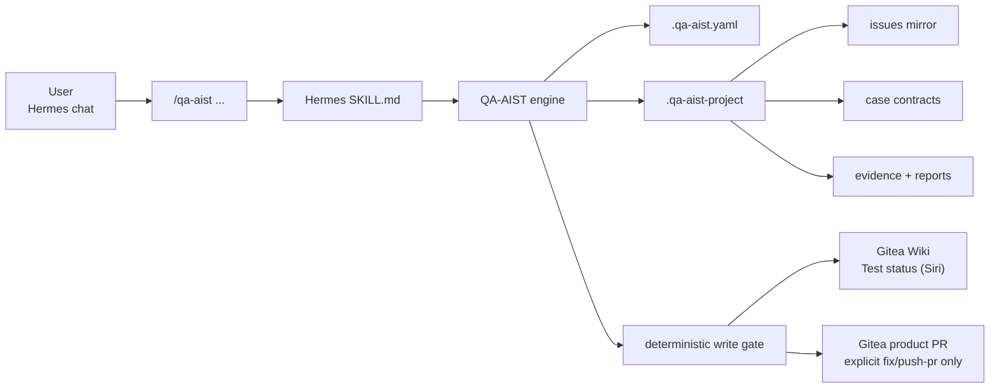
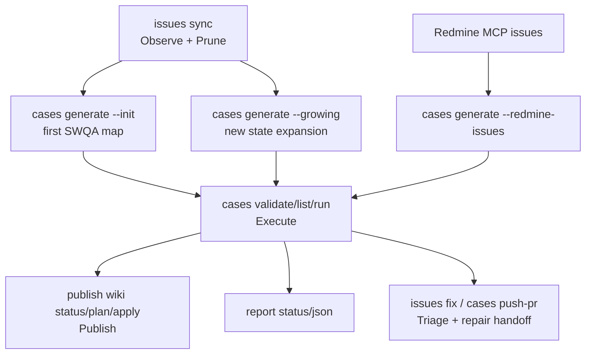

# QA-AIST


QA-AIST 是給 Hermes 使用的開源 SWQA lifecycle agent/plugin。使用者在 Hermes 聊天室輸入 `/qa-aist ...`，Hermes 依 `SKILL.md` 呼叫 deterministic QA-AIST engine，完成 issue sync、test case generation、test execution、evidence/report、Wiki status sync、write gate 與產品修復 PR handoff。

English summary: QA-AIST is a Hermes-first deterministic SWQA lifecycle engine for Gitea issue sync, executable test-case generation, evidence-based test execution, gated Wiki status sync, and product repair PR workflows.

## What Is QA-AIST?

QA-AIST 不是單純的 test runner，也不是讓 Hermes 任意拼 Gitea API 的捷徑。它把 SWQA lifecycle 收斂成少數 workflow commands：`issues`、`cases`、`publish wiki`、`close-loop`、`report`、`tracker`。

Hermes 可以協助讀 MCP、問少量問題、修 code、呈現選單；但 sync、dedupe、case contract、evidence、write gate、Wiki/PR 發布決策，都必須回到 QA-AIST engine。

## Lifecycle





Closed-loop policy pack:

```text
Observe -> Normalize -> Execute -> Triage -> Publish -> Evolve -> Prune
```

## Quick Start

1. Install Hermes skill from a QA-AIST checkout:

```bash
cd /root/repo/QA-AIST
PYTHONPATH=/root/repo/QA-AIST/src python3 -m qa_aist.hermes install-skill --force \
  --runner-command "/usr/bin/env PYTHONPATH=/root/repo/QA-AIST/src python3 -m qa_aist.hermes"
```

2. In Hermes chat:

```text
/reload-skills
/qa-aist help
```

3. In the product repo session:

```text
/qa-aist setup
/qa-aist doctor
/qa-aist issues sync
/qa-aist cases generate --init
/qa-aist cases validate
/qa-aist cases list
/qa-aist cases run <case_id>
/qa-aist publish wiki status
```

4. Run all cases when the first case is healthy:

```text
/qa-aist cases run
/qa-aist publish wiki apply
/qa-aist report status
```

`cases generate --init` is the first-time full-repo SWQA map. It is already fast/high-standard autonomous mode: QA-AIST scans README, code, package metadata, existing runners/cases/rules, then creates executable side-effect-safe probes across functional, positive, negative, boundary, invalid-input, side-effect-safe, and stress/timeout-risk dimensions. It should not ask you to approve cases one by one.

Use `--count` only when you intentionally want a smaller first batch:

```text
/qa-aist cases generate --init --count 5
```

For follow-up expansion after issues, PRs, latest runs, or reports changed:

```text
/qa-aist cases generate --growing
```

For Redmine issue IDs:

```text
/qa-aist cases generate --redmine-issues 144780 144693
```

## Public Commands

```text
/qa-aist help
/qa-aist setup
/qa-aist doctor

/qa-aist issues sync
/qa-aist issues status
/qa-aist issues show <issue_id>
/qa-aist issues fix --all
/qa-aist issues fix --issue <id>
/qa-aist issues fix --issue <id> --push-pr

/qa-aist cases generate --init
/qa-aist cases generate --init --count 5
/qa-aist cases generate --growing
/qa-aist cases generate --redmine-issues <id> [<id> ...]
/qa-aist cases review
/qa-aist cases validate
/qa-aist cases list
/qa-aist cases run
/qa-aist cases run <case_id>
/qa-aist cases push-pr
/qa-aist cases push-pr <case_id>

/qa-aist publish wiki status
/qa-aist publish wiki plan
/qa-aist publish wiki apply

/qa-aist close-loop status
/qa-aist close-loop run-once

/qa-aist report status
/qa-aist report json
/qa-aist tracker plan-write
```

`/qa-aist help` 顯示完整中文手冊與新手路徑。子分類 help 已移除。

## Command Guide

| 你想做的事 | Command |
|---|---|
| 初始化產品 repo | `/qa-aist setup` |
| 檢查 config、Gitea/Redmine MCP、Wiki readiness | `/qa-aist doctor` |
| 同步 issues，內建 dedupe/prune | `/qa-aist issues sync` |
| 看 issue sync、duplicate、fix queue、PR handoff | `/qa-aist issues status` |
| 首次產生全 repo SWQA cases | `/qa-aist cases generate --init` |
| 限制初始 case 數量 | `/qa-aist cases generate --init --count 5` |
| 依最新狀態擴散 cases | `/qa-aist cases generate --growing` |
| 從 Redmine IDs 產生 linked cases | `/qa-aist cases generate --redmine-issues <id> [<id> ...]` |
| 驗證 case contracts | `/qa-aist cases validate` |
| 列出 cases | `/qa-aist cases list` |
| 跑單一 case | `/qa-aist cases run <case_id>` |
| 跑全部 cases | `/qa-aist cases run` |
| 查看 Wiki 狀態 | `/qa-aist publish wiki status` |
| 產生 Wiki 草稿 | `/qa-aist publish wiki plan` |
| 套用 Wiki 更新 | `/qa-aist publish wiki apply` |
| 查看 closed-loop component health | `/qa-aist close-loop status` |
| 跑一輪 closed-loop | `/qa-aist close-loop run-once` |
| 產生報告 | `/qa-aist report status` |

## Project Layout

```text
your-product/
  .qa-aist.yaml
  .qa-aist-project/
    issues/       # Gitea/Redmine local mirrors
    cases/        # YAML case contracts
    runners/      # project-owned runner scripts
    rules/        # project rules and wiki categories
    state/        # snapshots, latest-run, wiki plans
    evidence/     # stdout/stderr/rc/meta/result JSON
    reports/      # Markdown/JSON reports
```

`.qa-aist` 是工具本體；`.qa-aist-project` 是 host project runtime data。不要把 token、password、lab credentials、customer data 寫進 tool source 或 tracked config。

## Case Contract

最小 case YAML：

```yaml
case_id: INIT-CLI-HELP
title: CLI help returns successfully
source:
  type: init
qa_aist:
  draft: false
  review_required_before_run: false
swqa_dimensions:
  - functional
  - positive
  - side_effect_safe
commands:
  - id: help
    run: python3 -m your_package --help
    expected_exit_code: 0
expected:
  summary: CLI help exits 0 and prints usage.
risk_controls:
  side_effect_safe: true
  requires_credentials: false
```

Every runnable case must have `commands[].run`. If a lab-only target, fixture, or credential is missing, QA-AIST should still generate a safe executable probe first and record stronger lab checks as follow-up metadata.

## Reports And Evidence

Each run stores:

- stdout
- stderr
- return code
- metadata
- normalized result JSON
- contract hash

Normalized result includes:

```json
{
  "case_id": "INIT-CLI-HELP",
  "status": "PASS",
  "commands": [],
  "evidence": [],
  "contract_hash": "...",
  "started_at": "...",
  "ended_at": "...",
  "exit_code": 0
}
```

Reports live under `.qa-aist-project/reports/`; evidence lives under `.qa-aist-project/evidence/`.

## Wiki Status

The default Wiki page is:

```yaml
tracker:
  provider: hermes_mcp
  wiki_page: "Test status (Siri)"
```

Wiki page structure:

```text
# Test status (Siri)
## 總覽
## 測試結果明細
## <dynamic categories>
## 補充 partial probes（不併入正式 case counters）
## 活動中的 Gitea issues
## 已關閉／歷史 issues（不列 active blocker）
## 六色帽回顧
```

`publish wiki apply` is Wiki-only. It never creates issue comments, new issues, or PRs.

QA-AIST does not write Gitea through its own token. `publish wiki apply` returns a gated MCP request; Hermes uses its configured Gitea MCP server to update the exact Wiki page in the same user flow, writes the MCP result JSON path requested by QA-AIST, then reports the result. There is no public second completion command.

## Gitea And Redmine MCP

`/qa-aist setup` writes MCP-only config. It does not store Gitea repo URLs, repo names, or token env names:

```yaml
tracker:
  provider: hermes_mcp
  wiki_page: "Test status (Siri)"
  mcp:
    required_servers:
      - gitea
      - redmine
    status_json: .qa-aist-project/state/hermes-mcp/status.json
    gitea_issues_json: .qa-aist-project/state/gitea-mcp/issues.json
    redmine_issues_json: .qa-aist-project/state/redmine-mcp/issues.json
    wiki_write_request_json: .qa-aist-project/state/gitea-mcp/wiki-write-request.json
    wiki_write_result_json: .qa-aist-project/state/gitea-mcp/wiki-write-result.json
```

Hermes must expose its available MCP servers to QA-AIST before `doctor` can call remote readiness ready. Either set `QA_AIST_HERMES_MCP_SERVERS=gitea,redmine` for the dispatcher process, or write `.qa-aist-project/state/hermes-mcp/status.json` with a server list. If Gitea or Redmine MCP is missing, `/qa-aist doctor` shows it at the beginning.

Hermes MCP usage is narrow:

- Gitea MCP may read issues before `/qa-aist issues sync`.
- Gitea MCP may update only the configured Wiki page after `/qa-aist publish wiki apply` returns a gated request.
- Redmine MCP may read requested issues before `/qa-aist cases generate --redmine-issues ...`.
- MCP must not create comments, issues, PRs, arbitrary Wiki pages, or bypass QA-AIST write gate.

## Removed Commands

Old public groups were intentionally collapsed. If the user types an old command, Hermes must call dispatcher and show the returned `command_removed` replacement instead of silently translating and executing.

High-level replacements:

| Old concept | New command |
|---|---|
| config/status checks | `/qa-aist doctor` |
| test listing/running | `/qa-aist cases list`, `/qa-aist cases run [case_id]` |
| issue dedupe | `/qa-aist issues sync` |
| issue repair/PR | `/qa-aist issues fix ...` |
| mixed publish | `/qa-aist publish wiki ...` |
| Gitea sync aliases | `/qa-aist issues sync` |
| issue-growth aliases | `/qa-aist cases generate --growing` |

## Developer / CI Usage

From an installed package:

```bash
qa-aist doctor --root /path/to/product
qa-aist issues sync --root /path/to/product
qa-aist cases generate --root /path/to/product --init
qa-aist cases run --root /path/to/product CASE-001
qa-aist publish wiki plan --root /path/to/product
```

From a source checkout:

```bash
PYTHONPATH=src python3 -m qa_aist.cli doctor --root /path/to/product
PYTHONPATH=src python3 -m qa_aist.cli cases run --root /path/to/product CASE-001
```

Run tests:

```bash
PYTHONPATH=src python3 -m unittest discover -s tests
```

## Open Source

Contributions should preserve these invariants:

- Hermes is a guided interface, not the policy owner.
- All runnable tests are case contracts.
- All evidence is persisted before status claims.
- Closed issues are remote truth and must not be reopened/commented accidentally.
- Wiki auto-sync is allowed only through the configured page and write gate.
- Product PR creation stays behind explicit `issues fix --issue <id> --push-pr` or `cases push-pr <case_id>`.
- Secrets are referenced by env var names, never stored raw.

Security issues: do not paste tokens or credentials into issues or examples. QA-AIST config should reference Hermes MCP handoff paths, not tracker tokens.

License: MIT.

## FAQ

### Why does bare `/qa-aist cases generate` not run?

Because generation has two very different meanings. Use `--init` for first-time full repo SWQA mapping, or `--growing` for follow-up expansion from latest state.

### Do I need to review every generated testcase?

No. `--init` and `--growing` should generate executable side-effect-safe probes. Hermes should only ask category-level blocking questions when QA-AIST returns `hermes_needs_input`.

### Can Gitea MCP write Wiki?

Yes, but only the configured Wiki page and only after `/qa-aist publish wiki apply` returns a gated MCP write request. MCP must not write issues, comments, PRs, or arbitrary pages.

### Where do Redmine issues enter?

Hermes Redmine MCP reads requested IDs, writes snapshot JSON, then QA-AIST validates it through `/qa-aist cases generate --redmine-issues <id> [<id> ...]`.
