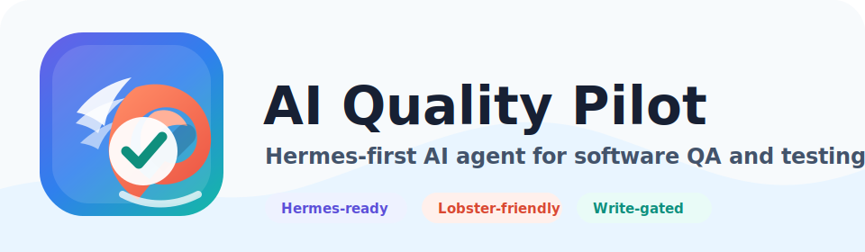
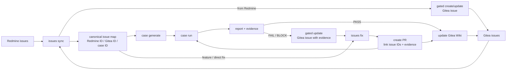
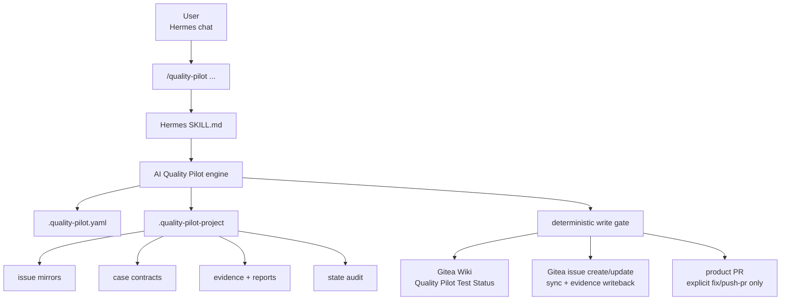

<p align="center">
  
</p>

# AI Quality Pilot


AI Quality Pilot 是給 Hermes 使用的 repo-agnostic SWQA close-loop agent/plugin。使用者在 Hermes 聊天室輸入 `/quality-pilot ...`，Hermes 依 `SKILL.md` 呼叫 deterministic AI Quality Pilot engine，完成 Redmine/Gitea issue sync、testcase generation、test execution、evidence/report、Wiki status sync、write gate 與產品修復 PR handoff。

English summary: AI Quality Pilot is a Hermes-first deterministic SWQA close-loop engine for Redmine/Gitea issue sync, executable test-case generation, evidence-based execution, truthful reporting, gated Wiki updates, and product repair workflows.

## North Star

AI Quality Pilot 的目標不是多包一層 CLI，而是把 SWQA lifecycle 變成可追蹤的單議題任務代理：

- 使用者只給 Redmine ID 或 Gitea issue context。
- 系統先分析 repo、runtime、Redmine/Gitea state、case contracts、evidence 和 reports。
- 能查明的事由 agent 自己處理，不把 binary path、issue mapping、snapshot freshness 這類問題丟回使用者。
- 只有真的缺外部資訊時才詢問，例如 credential env name、lab target、fixture/config path、side-effect boundary。
- Subagent 可以協助摘要、候選 testcase、報告文字、修復策略，但不能繞過 deterministic validation、write gate 或 evidence truth。

完整 flowchart-based 改善計畫見 [Agent Close Loop Improvement Plan](docs/AGENT_CLOSE_LOOP_IMPROVEMENT_PLAN.md)，追蹤任務見 [Quality Pilot UX Hardening Tasks](docs/QUALITY_PILOT_UX_HARDENING_TASKS.md)。

## What Is AI Quality Pilot?

AI Quality Pilot 不是單純的 test runner，也不是讓 Hermes 任意拼 tracker API 的捷徑。Hermes 可以協助讀 MCP、呈現選單、呼叫 subagent、問少量問題；但 sync、dedupe、case contract、evidence、write gate、Wiki/PR 發布決策，都必須回到 AI Quality Pilot engine。

Public workflow commands 收斂成：

- `setup`, `doctor`, `audit`
- `issues`
- `cases`
- `report`
- `publish wiki`
- `close-loop`
- `subagent`
- `tracker`

## Close-Loop Lifecycle

Target concept:



Current engine boundary:



Close-loop policy:

```text
Analyze -> Normalize -> Generate -> Execute -> Report -> Fix -> Publish -> Re-enter
```

## Agent Modules

| Module | Current Command Surface | Current State |
|---|---|---|
| A0 Orchestrator | `close-loop status`, `close-loop run-once` | Pipeline exists, module contract/session roadmap pending |
| A1 Redmine Intake | `issues sync --redmine-issues ...` | Full snapshot required, stale/trimmed payloads rejected |
| A2 Issues Sync | `issues sync`, `issues status` | Redmine/Gitea mirrors, dedupe, gated Gitea issue create/update, canonical mapping audit |
| A3 Case Generate | `cases generate --init/--growing/--redmine-issues ...` | Runtime-first, no placeholder cases when runtime missing |
| A4 Case Run | `cases run [case_id]` | Evidence persisted with result metadata and contract hash |
| A5 Issues Report | `issues report`, `report status/json` | Per-issue report exists and FAIL/BLOCK results create gated linked Gitea issue evidence update payloads; richer subagent wording and module session state remain roadmap work |
| A6 Issues Fix | `issues fix ...`, `cases push-pr ...` | Repair/feature handoff exists after sync; PR bodies/linkage metadata now include issue/case/evidence paths; stricter post-fix retest loop remains roadmap work |
| A7 Update Wiki | `publish wiki status/plan/apply` | Gated Wiki update, truth-source hardening in progress |
| A8 Gitea Output | Hermes Gitea MCP request/result files | One ledger records issue create/update, evidence writeback, PR linkage, and Wiki write gates first-pass; richer reconciliation remains roadmap work |

Current status: partial close loop. The tool can already sync, generate, run, report, gate writes, and hand off fixes, but the full A0-A8 module contract, resumable session state, subagent result ledger, and one-command autonomous loop are still roadmap work.

## Quick Start

1. Install Hermes skill from an AI Quality Pilot checkout:

```bash
cd "/root/repo/AI Quality Pilot"
SRC="$PWD/src"
RUNNER="$HOME/.local/bin/quality-pilot-hermes"
mkdir -p "$(dirname "$RUNNER")"
cat > "$RUNNER" <<SH
#!/usr/bin/env bash
set -euo pipefail
export PYTHONPATH="$SRC\${PYTHONPATH:+:\$PYTHONPATH}"
exec python3 -m quality_pilot.hermes "\$@"
SH
chmod +x "$RUNNER"
PYTHONPATH="$SRC" python3 -m quality_pilot.hermes install-skill --force --runner-command "$RUNNER"
```

2. Reload Hermes skills:

```text
/reload-skills
/quality-pilot help
```

3. Initialize a product repo:

```text
/quality-pilot setup
/quality-pilot doctor --fix
/quality-pilot doctor
/quality-pilot audit state
```

4. Generate and run repo-level SWQA cases:

```text
/quality-pilot cases generate --init
/quality-pilot cases validate
/quality-pilot cases list
/quality-pilot cases run <case_id>
/quality-pilot report status
```

5. Run all cases and publish Wiki only after the first case is healthy:

```text
/quality-pilot cases run
/quality-pilot publish wiki status
/quality-pilot publish wiki apply
```

## Redmine Flow

For Redmine issue IDs:

```text
/quality-pilot issues sync --redmine-issues 145085
/quality-pilot cases generate --redmine-issues 145085
/quality-pilot cases run REDMINE-145085
/quality-pilot report status
/quality-pilot publish wiki plan
```

`145085` is only an example. Multiple Redmine IDs are supported.

Important behavior:

- Hermes Redmine MCP must live-read the requested IDs and write a full snapshot manifest.
- Redmine snapshots must include full description, `updated_on`, custom fields, journals/comments, and attachments metadata.
- `issues sync --redmine-issues ...` gated creates or updates the linked Gitea issue. It is not only a local mirror.
- If a linked Gitea issue already exists, Redmine sync must reuse/update it through idempotent gated handoff instead of duplicating it.
- Trimmed, legacy, or stale snapshots are rejected for Redmine-linked generation.
- Redmine testcase commands must be product-binary/API/runner oriented. Developer commands such as `go test`, `go run`, pytest, build scripts, and internal unit-test names are treated as implementation hints, not QA commands.
- If exact lab reproduction needs credentials, target resources, or fixtures, AI Quality Pilot records the environment requirements and uses product-entrypoint fallback probes until the missing external facts are provided.
- Generated testcase commands must use the configured/inferred product entrypoint or a user-confirmed runner. Repo-only probes, static metadata checks, synthetic invalid commands, and developer test commands are not allowed as `commands[].run`.

## Runtime Profile

`doctor` and `setup` analyze the repo before asking the user anything. They inspect package metadata, README command examples, common executable output paths, Go `cmd/*`, Python console scripts, npm bins, Cargo bins, and existing project state.

If a product executable is found, `runtime_profile.status` becomes `ready_inferred` and Hermes should not ask the user to confirm the binary path. If no runnable entrypoint can be proven, `cases generate --init` and `--growing` return `needs_input`, write no placeholder YAML, and show bullet-listed questions for only the missing external facts.

Runtime config fields:

```yaml
runtime:
  primary_entrypoint: ""
  binary_env: QUALITY_PILOT_BINARY
  target_host_env: QUALITY_PILOT_TARGET_HOST
  fixture_paths: []
  credential_envs: []
  side_effect_boundary: ""
```

Rules:

- Raw secrets are never stored. Use env var names such as `OPEN_WEBUI_API_KEY` or `QUALITY_PILOT_TEST_PASSWORD`.
- Repo-only metadata checks are readiness probes, not testcase contracts.
- Runtime analysis can choose the executable, but it cannot turn repo metadata into a fake executable test.
- A generated runnable case must have a real `commands[].run` and a clear side-effect boundary.
- Lab-only tests should list required binary, target/resource, fixture/config, credential env names, success conditions, and side-effect boundary.

## Subagent Text Generation

Subagents are candidate-only helpers. They can draft Gitea issue bodies, PR bodies, Wiki summaries, Redmine summaries, case candidate analysis, and reviewer notes. They must not write files, create issues, update Wiki pages, open PRs, close issues, or bypass validation/write gates.

Default profile:

```yaml
subagents:
  enabled: true
  default_profile: open-webui
  profiles:
    open-webui:
      provider: open_webui
      endpoint: "https://172.17.20.220/"
      model: ""
      api_base: ""
      api_key_env: ""
```

Simple setup options:

```yaml
endpoint: "https://172.17.20.220/?model=qwen3.6-chat-direct"
```

or:

```yaml
endpoint: "https://172.17.20.220/"
model: "qwen3.6-chat-direct"
api_key_env: "OPEN_WEBUI_API_KEY"
```

Use:

```text
/quality-pilot subagent status
/quality-pilot subagent configure
/quality-pilot doctor --fix
```

`doctor --fix` and `subagent configure` can create the Open WebUI skeleton. The user-owned model/API key env remain explicit config because the tool must not guess raw credentials.

## Public Commands

```text
/quality-pilot help
/quality-pilot setup
/quality-pilot doctor
/quality-pilot doctor --fix
/quality-pilot audit state

/quality-pilot issues sync
/quality-pilot issues sync --redmine-issues <redmine_issue_id> [<redmine_issue_id> ...]
/quality-pilot issues status
/quality-pilot issues report
/quality-pilot issues show <issue_id>
/quality-pilot issues fix --all
/quality-pilot issues fix --issue <id>
/quality-pilot issues fix --issue <id> --push-pr

/quality-pilot cases generate --init
/quality-pilot cases generate --init --count 5
/quality-pilot cases generate --growing
/quality-pilot cases generate --redmine-issues <redmine_issue_id> [<redmine_issue_id> ...]
/quality-pilot cases review
/quality-pilot cases validate
/quality-pilot cases list
/quality-pilot cases run
/quality-pilot cases run <case_id>
/quality-pilot cases push-pr
/quality-pilot cases push-pr <case_id>

/quality-pilot publish wiki status
/quality-pilot publish wiki plan
/quality-pilot publish wiki apply

/quality-pilot close-loop status
/quality-pilot close-loop run-once

/quality-pilot report status
/quality-pilot report json
/quality-pilot subagent status
/quality-pilot subagent configure
/quality-pilot tracker plan-write
```

`/quality-pilot help` 顯示完整中文手冊與新手路徑。子分類 help 已移除。

## Command Guide

| 你想做的事 | Command |
|---|---|
| 初始化產品 repo | `/quality-pilot setup` |
| 檢查 config、runtime、subagent、Gitea/Redmine MCP、Wiki readiness | `/quality-pilot doctor` |
| 修復缺失 config skeleton / overlay 目錄後再檢查 | `/quality-pilot doctor --fix` |
| 只讀稽核 overlay semantic consistency | `/quality-pilot audit state` |
| 同步 issues，內建 dedupe/prune | `/quality-pilot issues sync` |
| 從 Redmine IDs 同步本地 mirrors 並經 gate 建立/更新 linked Gitea issues | `/quality-pilot issues sync --redmine-issues <redmine_issue_id> [<redmine_issue_id> ...]` |
| 看 issue sync、duplicate、fix queue、PR handoff | `/quality-pilot issues status` |
| 產生每個 issue 的 QA report，並為 FAIL/BLOCK 產生 linked Gitea evidence update handoff | `/quality-pilot issues report` |
| 從已同步 issue 直接開始修復或新功能開發 handoff | `/quality-pilot issues fix --issue <id>` |
| 首次產生全 repo SWQA cases | `/quality-pilot cases generate --init` |
| 限制初始 case 數量 | `/quality-pilot cases generate --init --count 5` |
| 依最新狀態擴散 cases | `/quality-pilot cases generate --growing` |
| 從 Redmine IDs 直接產生 linked cases | `/quality-pilot cases generate --redmine-issues <redmine_issue_id> [<redmine_issue_id> ...]` |
| 驗證 case contract schema | `/quality-pilot cases validate` |
| 列出 cases | `/quality-pilot cases list` |
| 跑單一 case | `/quality-pilot cases run <case_id>` |
| 跑全部 cases | `/quality-pilot cases run` |
| 查看 Wiki 狀態 | `/quality-pilot publish wiki status` |
| 產生 Wiki 草稿 | `/quality-pilot publish wiki plan` |
| 套用 Wiki 更新 | `/quality-pilot publish wiki apply` |
| 查看 close-loop component health | `/quality-pilot close-loop status` |
| 跑一輪 close-loop | `/quality-pilot close-loop run-once` |
| 產生報告 | `/quality-pilot report status` |
| 設定 subagent | `/quality-pilot subagent configure` |

## Project Layout

```text
your-product/
  .quality-pilot.yaml
  .quality-pilot-project/
    issues/       # Gitea/Redmine local mirrors
    cases/        # YAML case contracts
    runners/      # project-owned runner scripts
    rules/        # project rules and wiki categories
    state/        # snapshots, latest-run, handoff requests/results
    evidence/     # stdout/stderr/rc/meta/result JSON
    reports/      # Markdown/JSON reports
```

`.quality-pilot` is tool source; `.quality-pilot-project` is host project runtime data. Do not write tokens, passwords, lab credentials, or customer data into tool source, tracked config, case YAML, issue mirrors, reports, or Wiki content.

## Case Contract

Minimal runnable case YAML:

```yaml
case_id: INIT-CLI-HELP
title: CLI help returns successfully
source:
  type: init
quality_pilot:
  draft: false
  review_required_before_run: false
swqa_dimensions:
  - functional
  - positive
  - side_effect_safe
commands:
  - id: help
    run: "${QUALITY_PILOT_BINARY:-python3 -m your_package} --help"
    expected_exit_code: 0
expected:
  summary: CLI help exits 0 and prints usage.
risk_controls:
  side_effect_safe: true
  requires_credentials: false
```

Every runnable case must have `commands[].run`. If runtime is unknown, AI Quality Pilot must return `needs_input` and write no fake case. If a lab-only target, fixture, or credential is missing, it should generate a product-runtime command only when one can be proven safe, and record stronger lab checks as follow-up metadata.

## Reports, Evidence, And Truth Gates

Each run stores:

- stdout
- stderr
- return code
- metadata
- normalized result JSON
- contract hash

Normalized result includes:

```json
{
  "case_id": "INIT-CLI-HELP",
  "status": "PASS",
  "commands": [],
  "evidence": [],
  "contract_hash": "...",
  "started_at": "...",
  "ended_at": "...",
  "exit_code": 0
}
```

Reports live under `.quality-pilot-project/reports/`; evidence lives under `.quality-pilot-project/evidence/`.

Truth rules:

- `cases validate` checks schema.
- `audit state` checks semantic consistency across cases, evidence, issue mirrors, Gitea handoff, Wiki reports, MCP status, and subagent readiness.
- PASS evidence must map to the current case command and contract hash.
- Wiki must not claim READY when latest run, state audit, or listed cases disagree.
- Active Redmine/Gitea issues without runnable cases must be blockers, not hidden warnings.

## Wiki Status

The default Wiki page is:

```yaml
tracker:
  provider: hermes_mcp
  wiki_page: "Quality Pilot Test Status"
```

Wiki page structure:

```text
# Quality Pilot Test Status
## 總覽
## 測試結果明細
## <dynamic categories>
## 補充 partial probes（不併入正式 case counters）
## 活動中的 Gitea issues
## 已關閉／歷史 issues（不列 active blocker）
## 六色帽回顧
```

`publish wiki apply` is Wiki-only. It never creates issue comments, new issues, or PRs.

AI Quality Pilot does not write Gitea through its own token. `publish wiki apply` returns a gated MCP request; Hermes uses its configured Gitea MCP server to update the exact Wiki page, writes the MCP result JSON path requested by AI Quality Pilot, then reports the result. There is no public second completion command.

## Gitea And Redmine MCP

`/quality-pilot setup` writes MCP-only config. It does not store Gitea repo URLs, repo names, tracker token env names, or HTTP credentials:

```yaml
tracker:
  provider: hermes_mcp
  wiki_page: "Quality Pilot Test Status"
  mcp:
    required_servers:
      - gitea
      - redmine
    status_json: .quality-pilot-project/state/hermes-mcp/status.json
    gitea_issues_json: .quality-pilot-project/state/gitea-mcp/issues.json
    redmine_issues_json: .quality-pilot-project/state/redmine-mcp/issues.json
    wiki_write_request_json: .quality-pilot-project/state/gitea-mcp/wiki-write-request.json
    wiki_write_result_json: .quality-pilot-project/state/gitea-mcp/wiki-write-result.json
```

Hermes must expose available MCP servers before `doctor` can mark remote readiness as ready. Either set this for the dispatcher process:

```bash
QUALITY_PILOT_HERMES_MCP_SERVERS=gitea,redmine
```

or write `.quality-pilot-project/state/hermes-mcp/status.json`:

```json
{
  "servers": ["gitea", "redmine"]
}
```

Hermes MCP usage is narrow:

- Gitea MCP may read issues before `/quality-pilot issues sync`.
- Gitea MCP may create or update linked Gitea issues only after AI Quality Pilot returns a gated issue write request, including Redmine sync create/update and FAIL/BLOCK evidence writeback.
- Gitea MCP may update only the configured Wiki page after `/quality-pilot publish wiki apply` returns a gated request.
- Redmine MCP may read requested issues before `/quality-pilot issues sync --redmine-issues ...` or `/quality-pilot cases generate --redmine-issues ...`.
- MCP must not create comments, edit/close/reopen unrelated issues, create PRs, write arbitrary Wiki pages, or bypass AI Quality Pilot write gate.

## Removed Commands

Old public groups were intentionally collapsed. If the user types an old command, Hermes must call dispatcher and show the returned `command_removed` replacement instead of silently translating and executing.

High-level replacements:

| Old concept | New command |
|---|---|
| config/status checks | `/quality-pilot doctor` |
| test listing/running | `/quality-pilot cases list`, `/quality-pilot cases run [case_id]` |
| issue dedupe | `/quality-pilot issues sync` |
| issue repair/PR | `/quality-pilot issues fix ...` |
| mixed publish | `/quality-pilot publish wiki ...` |
| Gitea sync aliases | `/quality-pilot issues sync` |
| issue-growth aliases | `/quality-pilot cases generate --growing` |

## Developer / CI Usage

From an installed package:

```bash
quality-pilot doctor --root /path/to/product
quality-pilot doctor --fix --root /path/to/product
quality-pilot audit state --root /path/to/product
quality-pilot issues sync --root /path/to/product
quality-pilot cases generate --root /path/to/product --init
quality-pilot cases run --root /path/to/product CASE-001
quality-pilot publish wiki plan --root /path/to/product
```

From a source checkout:

```bash
PYTHONPATH=src python3 -m quality_pilot.cli doctor --root /path/to/product
PYTHONPATH=src python3 -m quality_pilot.cli cases run --root /path/to/product CASE-001
```

Run tests:

```bash
PYTHONPATH=src python3 -m unittest discover -s tests
```

## Open Source

Contributions should preserve these invariants:

- Hermes is a guided interface, not the policy owner.
- Analyze repo/state/tracker evidence before asking users for missing inputs.
- All runnable tests are case contracts.
- Runtime-missing placeholder tests are not allowed.
- Case generation must use the product runtime/runner. It must not write `python3 -c` repo checks, `compileall`, synthetic invalid commands, `go test`, or `go run` as testcase commands unless those are the explicitly configured user-facing product runner.
- All evidence is persisted before status claims.
- Closed issues are remote truth and must not be reopened/commented accidentally.
- Wiki auto-sync is allowed only through the configured page and write gate.
- Product PR creation stays behind explicit `issues fix --issue <id> --push-pr` or `cases push-pr <case_id>`.
- PR handoff/body metadata must link the Gitea issue ID, Redmine ID when present, case IDs, and evidence paths.
- `issues fix --issue <id>` may start from a synced issue even before a runnable case exists, but `--push-pr` requires acceptance cases/evidence first.
- Subagents generate candidates only and cannot bypass validation or write gates.
- Secrets are referenced by env var names, never stored raw.

Security issues: do not paste tokens or credentials into issues or examples. AI Quality Pilot config should reference Hermes MCP handoff paths and credential env names, not tracker tokens or raw secrets.

License: MIT.

## FAQ

### Why does bare `/quality-pilot cases generate` not run?

Because generation has different modes. Use `--init` for first-time repo SWQA mapping, `--growing` for follow-up expansion from latest state, or `--redmine-issues` for linked Redmine cases.

### Do I need to review every generated testcase?

No. `--init` and `--growing` should generate executable product-runtime command contracts after runtime is inferred or confirmed. Hermes should only ask category-level blocking questions when AI Quality Pilot returns `hermes_needs_input`.

### Why did it ask for runtime or environment details?

It should ask only after repo analysis. If `runtime_profile.status` is `ready_inferred`, it should not ask for the binary path. If runtime, fixture, credential env names, lab target, or side-effect boundary cannot be proven from repo/config/state, it asks once with bullet-listed missing fields.

### Can Gitea MCP write Wiki?

Yes, but only the configured Wiki page and only after `/quality-pilot publish wiki apply` returns a gated MCP write request. For issues, Gitea MCP may create or update linked issues only from AI Quality Pilot gated requests such as Redmine sync or FAIL/BLOCK evidence writeback; it must not comment, edit unrelated issues, close/reopen issues, create PRs, or write arbitrary pages.

### Where do Redmine issues enter?

Hermes Redmine MCP reads requested IDs and writes full snapshot JSON. Use `/quality-pilot issues sync --redmine-issues <redmine_issue_id> [<redmine_issue_id> ...]` when you want AI Quality Pilot to mirror those tickets and gated create/update linked Gitea issues. Use `/quality-pilot cases generate --redmine-issues <redmine_issue_id> [<redmine_issue_id> ...]` when you want linked testcase contracts directly; this command does not create a Gitea issue plan.
