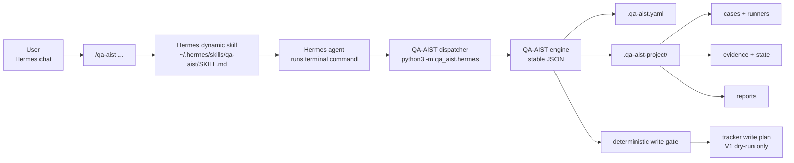
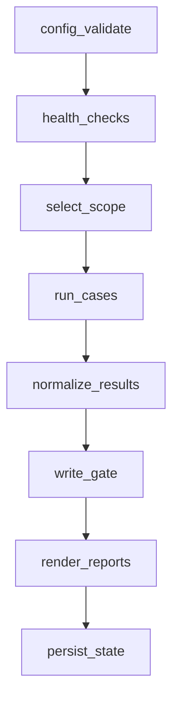

# QA-AIST


QA-AIST 是給 Hermes agent 使用的 QA 自動化 skill：使用者在 Hermes 聊天視窗輸入 `/qa-aist ...`，Hermes 透過 `~/.hermes/skills/qa-aist/SKILL.md` 載入操作規則，再由 agent 呼叫 QA-AIST 的 deterministic Python engine 來初始化專案、跑測試、保存 evidence、產生 report、規劃 tracker write plan。

English summary: QA-AIST is a Hermes dynamic skill backed by a deterministic Python QA engine. It exposes `/qa-aist ...` in Hermes chat through `SKILL.md`; the engine remains the stable CLI/API used by Hermes, CI, and local debugging.

**目前最重要的邊界**

QA-AIST V1 不是 Hermes 原生 router，也不是把 Python package 安裝好就會自動出現 `/qa-aist`。目前可運作的 Hermes 整合方式是 **dynamic skill slash command**：Hermes 看到 `/qa-aist ...` 後載入 skill 指示，agent 必須依照 SKILL 內容呼叫 QA-AIST dispatcher。若你需要完全不經 LLM/agent 的 native slash command，必須另外修改 Hermes router 或 plugin。

## What Is QA-AIST?

QA-AIST 把「測試怎麼跑、證據存哪裡、什麼時候可以規劃 tracker 寫入」變成一條固定、可檢查、可重跑的流程。一般使用者只需要在 Hermes 聊天室下 `/qa-aist ...`，不需要自己拼 shell command、tracker comment、reopen 或 close issue。

QA-AIST 適合導入到不同產品 repo。工具本體可以是獨立 checkout、套件安裝，或 vendored 到產品 repo；產品專案自己的 config、cases、runners、evidence、reports 固定放在 host repo 的 `.qa-aist-project`。

## Integration Modes

| Mode | 目前狀態 | 使用者看到的介面 | 說明 |
|---|---|---|---|
| Hermes dynamic skill | 支援 | `/qa-aist ...` | 目前主路徑。安裝 `~/.hermes/skills/qa-aist/SKILL.md`，Hermes agent 依 skill 指示呼叫 engine。 |
| Direct engine | 支援 | `python3 -m qa_aist.hermes ...` or `qa-aist ...` | 給 CI、本機除錯、Hermes skill 背後實際執行用。 |
| Native Hermes router/plugin | 尚未實作 | `/qa-aist ...` | 需要 Hermes 本體或 plugin router 在 LLM 前直接呼叫 `dispatch_chat_command()`。 |

## How It Works



實際流程：

1. 使用者在 Hermes 聊天室輸入 `/qa-aist doctor`。
2. Hermes 透過 skill scanner 找到 `~/.hermes/skills/qa-aist/SKILL.md`。
3. SKILL 指示 agent 從目前產品 repo root 執行 QA-AIST dispatcher。
4. Dispatcher 呼叫 deterministic engine，輸出 stable JSON。
5. Agent 回覆 JSON 裡的 `chat_response`，並保留 report/evidence path。

## 5-minute Quick Start

前提：你已經有 Hermes agent，並且有一個要導入 QA-AIST 的產品 repo。以下假設 QA-AIST source checkout 在 `/root/repo/QA-AIST`；如果你的路徑不同，把路徑換掉。

### 1. 安裝 Hermes skill

在 terminal 執行一次：

```bash
cd /root/repo/QA-AIST
PYTHONPATH=/root/repo/QA-AIST/src python3 -m qa_aist.hermes install-skill --force \
  --runner-command "/usr/bin/env PYTHONPATH=/root/repo/QA-AIST/src python3 -m qa_aist.hermes"
```

這會建立：

```text
~/.hermes/skills/qa-aist/SKILL.md
```

這才是目前 Hermes 會掃描的安裝位置。不要把 QA-AIST 檔案放進 `/usr/local/lib/hermes-agent/agent` 期待它自動變成 slash command。

### 2. 檢查 skill 安裝狀態

```bash
PYTHONPATH=/root/repo/QA-AIST/src python3 -m qa_aist.hermes skill-status
```

預期看到：

```json
{
  "status": "ok",
  "command_prefix": "/qa-aist",
  "skill_valid": true
}
```

如果 `qa-aist-hermes: command not found`，這不是 Hermes 壞掉，而是 console script 沒安裝到目前 shell。請先使用上面的 `PYTHONPATH=... python3 -m qa_aist.hermes ...` 形式。

### 3. 讓 Hermes 重掃 skills

在 Hermes 聊天視窗輸入：

```text
/reload-skills
```

然後確認你的 Hermes session 正在產品 repo root，不是在 QA-AIST source repo。`/qa-aist setup` 會在目前產品 repo 建立 `.qa-aist.yaml` 和 `.qa-aist-project`。

### 4. 在 Hermes 聊天室操作 QA-AIST

```text
/qa-aist setup
/qa-aist doctor
/qa-aist qa-test list
/qa-aist qa-test run-one EXAMPLE-001
/qa-aist close-loop run-once
/qa-aist report status
/qa-aist tracker plan-write
```

常見回覆會長這樣：

```text
qa-aist> PASS
         cases: 1
         runners: 1
         latest_run_json: .qa-aist-project/state/latest-run.json
         report: .qa-aist-project/reports/status.md
```

### 5. 不經 Hermes 的 smoke test

如果你懷疑 Hermes 沒有正確觸發 skill，先直接測 dispatcher。請在產品 repo 執行：

```bash
cd /path/to/your-product
PYTHONPATH=/root/repo/QA-AIST/src python3 -m qa_aist.hermes --root "$PWD" /qa-aist doctor
```

如果產品 repo 尚未初始化：

```bash
PYTHONPATH=/root/repo/QA-AIST/src python3 -m qa_aist.hermes --root "$PWD" /qa-aist setup
PYTHONPATH=/root/repo/QA-AIST/src python3 -m qa_aist.hermes --root "$PWD" /qa-aist doctor
```

## Command Cheat Sheet

這些是 Hermes 聊天室裡的主介面。背後實際會由 SKILL 指示 agent 呼叫 QA-AIST dispatcher。

| 你想做的事 | Hermes command | 常見結果 |
|---|---|---|
| 初始化產品 repo | `/qa-aist setup` | 建立 `.qa-aist.yaml` 和 `.qa-aist-project` starter files |
| 看目前狀態 | `/qa-aist status` | 顯示 config/workspace/case count/latest run |
| 做健康檢查 | `/qa-aist doctor` | 檢查 config、paths、runners、secret references |
| 顯示設定 | `/qa-aist config show` | 輸出解析後的 host config |
| 驗證設定 | `/qa-aist config validate` | 缺欄位或 raw secret 會被拒絕 |
| 列出測試 cases | `/qa-aist qa-test list` | 讀取 `.qa-aist-project/cases/*.yaml` |
| 驗證 case contracts | `/qa-aist qa-test validate` | 檢查必填欄位與 command order |
| 預覽會跑什麼 | `/qa-aist qa-test dry-run` | 產生 NOT_RUN 結果，不執行 command |
| 跑全部 cases | `/qa-aist qa-test run` | 為每個 case 保存 evidence |
| 跑單一 case | `/qa-aist qa-test run-one <case_id>` | 最適合第一次除錯 |
| 看 close-loop 狀態 | `/qa-aist close-loop status` | 顯示 pipeline order 和 latest run |
| 跑完整 close-loop | `/qa-aist close-loop run-once` | 執行固定 deterministic pipeline |
| 產生 Markdown report | `/qa-aist report status` | 寫入 `.qa-aist-project/reports/status.md` |
| 取得 latest run JSON | `/qa-aist report json` | 給 Hermes rendering 或 CI 使用 |
| 規劃 tracker 寫入 | `/qa-aist tracker plan-write` | V1 dry-run only，必經 write gate |

## Project Layout

初始化後，產品 repo 會出現：

```text
your-product/
  .qa-aist.yaml                 # host-owned config
  .qa-aist-project/             # host-owned runtime data
    cases/                      # YAML case contracts
    runners/                    # product-specific runner scripts
    rules/                      # deterministic QA rules
    state/                      # latest-run.json
    evidence/                   # stdout/stderr/rc/meta/result JSON
    reports/                    # Markdown or JSON reports
```

如果你把 QA-AIST vendored 進產品 repo，建議是：

```text
your-product/
  .qa-aist/                     # QA-AIST tool source checkout
  .qa-aist.yaml                 # product config
  .qa-aist-project/             # product runtime data
```

邊界很重要：

- `.qa-aist` 是工具本體，不放產品執行結果。
- `.qa-aist-project` 是產品 runtime data，放 cases、runners、state、evidence、reports。
- `.qa-aist.yaml` 是產品 repo 自己擁有的設定。
- token、password、API key 不應寫進 tracked config；只存 env var 名稱。

## Case Contract

使用者在 `.qa-aist-project/cases/*.yaml` 定義 ordered commands。QA-AIST 會照順序執行，保存每個 command 的 stdout、stderr、return code、metadata，並計算整份 contract 的 `contract_hash`。

最小範例：

```yaml
case_id: EXAMPLE-001
title: Project smoke test
commands:
  - id: smoke
    run: .qa-aist-project/runners/example-runner.sh
    expected_exit_code: 0
```

也可以直接寫產品測試指令：

```yaml
case_id: CLI-HELP-001
title: CLI help can be rendered
commands:
  - id: help
    run: python3 -m your_package --help
    expected_exit_code: 0
```

必填欄位：

| Field | Required | Meaning |
|---|---:|---|
| `case_id` | yes | Stable case identifier |
| `title` | yes | Human-readable title |
| `commands[].id` | yes | Stable command identifier inside the case |
| `commands[].run` | yes | Shell command or project runner path |
| `commands[].expected_exit_code` | yes | Expected process return code |

## Close-loop Pipeline

`/qa-aist close-loop run-once` 會鎖定順序執行，不讓 Hermes 或任何 agent 自行跳步：



Close-loop summary JSON 固定包含：

```json
{
  "status": "PASS",
  "run_id": "2026-06-08T000000Z",
  "case_counts": {"PASS": 1, "FAIL": 0, "BLOCK": 0, "ABORT": 0, "NOT_RUN": 0},
  "latest_run_json": ".qa-aist-project/state/latest-run.json",
  "report_path": ".qa-aist-project/reports/status.md",
  "tracker_writes": {"blocked_by_gate": 1}
}
```

## Reports And Evidence

每次 run 都會保存 normalized result JSON，核心欄位包含：

```json
{
  "case_id": "EXAMPLE-001",
  "status": "PASS",
  "commands": [],
  "evidence": [],
  "contract_hash": "sha256...",
  "started_at": "2026-06-08T00:00:00Z",
  "ended_at": "2026-06-08T00:00:01Z",
  "exit_code": 0
}
```

Evidence layout：

```text
.qa-aist-project/evidence/
  EXAMPLE-001/
    smoke.stdout.log
    smoke.stderr.log
    smoke.rc
    smoke.meta
    result.json
```

常用輸出：

```text
.qa-aist-project/state/latest-run.json
.qa-aist-project/reports/status.md
```

## Write Gate

QA-AIST 的 tracker 原則是：先證據、再 gate、最後才可能規劃寫入。V1 不做真實 tracker 寫入，只產生 deterministic plan。

| Gate condition | V1 result | Reason |
|---|---|---|
| Target issue is closed | denied | `closed_issue_write_forbidden` |
| Expected contract hash differs | denied | `contract_drift` |
| Current evidence is missing | denied | `missing_current_evidence` |
| Raw secret appears in config/result | denied | `raw_secret_detected` |
| Tracker provider is `none` or disabled | blocked plan | `tracker_disabled` |
| Evidence is current and tracker is enabled | allowed plan | `allowed` |

Hermes 不應該自己組 tracker comment，也不應該自行判斷要 reopen、close 或 comment。所有 tracker intent 都要經過 `/qa-aist tracker plan-write` 或 close-loop 裡的 write gate。

## What QA-AIST Is Not

- 不是安裝 Python package 後自動出現在 Hermes 的原生 plugin。
- 不是讓 Hermes 任意拼接 shell command 或 tracker action 的捷徑。
- 不是用 LLM 自行判斷「這次應該跳過 health check」的流程。
- 不是 V1 就會真的寫 Gitea、Redmine、GitHub Issues 或其他 tracker。
- 不是把產品測試資料放進 QA-AIST tool source 的資料夾。

## Hermes Skill Contract

`~/.hermes/skills/qa-aist/SKILL.md` 必須和這份 README 一致。它的職責不是自己實作 QA 邏輯，而是要求 Hermes agent 做這件事：

```bash
/usr/bin/env PYTHONPATH=/root/repo/QA-AIST/src python3 -m qa_aist.hermes --root "$PWD" /qa-aist <arguments>
```

SKILL 應該要求 agent：

- 把 `/qa-aist <arguments>` 視為 QA-AIST command。
- 從目前產品 repo root 執行 dispatcher。
- 不從記憶回答、不手刻 tracker comment、不發明 evidence path。
- 讀取 dispatcher 回傳 JSON。
- 優先回覆 JSON 裡的 `chat_response`。

如果 Hermes skill 被觸發但 agent 沒有跑 terminal command，請提醒 agent 依 `~/.hermes/skills/qa-aist/SKILL.md` 執行 dispatcher。這是 dynamic skill 模式的限制，不是 QA-AIST engine 本身不會跑。

## Developer / CI Usage

一般使用者優先看 Hermes chat 的 `/qa-aist ...`。下面是給 QA-AIST 維護者、Hermes 整合者、CI pipeline、本機除錯使用。

從 source checkout 直接呼叫 Hermes dispatcher：

```bash
cd /path/to/your-product
PYTHONPATH=/root/repo/QA-AIST/src python3 -m qa_aist.hermes --root "$PWD" /qa-aist status
PYTHONPATH=/root/repo/QA-AIST/src python3 -m qa_aist.hermes --root "$PWD" /qa-aist doctor
PYTHONPATH=/root/repo/QA-AIST/src python3 -m qa_aist.hermes --root "$PWD" /qa-aist qa-test list
PYTHONPATH=/root/repo/QA-AIST/src python3 -m qa_aist.hermes --root "$PWD" /qa-aist close-loop run-once
```

若已安裝 console scripts：

```bash
qa-aist-hermes --root /path/to/your-product /qa-aist doctor
qa-aist --json doctor --root /path/to/your-product
```

Ubuntu 若出現 `externally-managed-environment`，不要硬改系統 Python。請用 `PYTHONPATH=... python3 -m qa_aist.hermes ...`、venv、pipx，或 distro package 流程。

跑測試：

```bash
cd /root/repo/QA-AIST
PYTHONPATH=src python3 -m unittest discover -s tests
```

## Configuration

`.qa-aist.yaml` 是產品 repo 擁有的設定檔。V1 必要區塊包含：

```yaml
project:
  name: your-product
  default_branch: main
paths:
  workspace: .qa-aist-project
  cases: .qa-aist-project/cases
  runners: .qa-aist-project/runners
  rules: .qa-aist-project/rules
  state: .qa-aist-project/state
  evidence: .qa-aist-project/evidence
  reports: .qa-aist-project/reports
tracker:
  provider: none
policy:
  require_write_gate: true
```

Secret policy：

- Good: `api_token_env: GITEA_TOKEN`
- Bad: `api_token: abc123...`

QA-AIST 可以檢查 env var 名稱是否存在，但不應把 raw value 寫進 config、evidence、report 或 chat output。

## Troubleshooting

| Symptom | Try this |
|---|---|
| `qa-aist-hermes: command not found` | 使用 `PYTHONPATH=/root/repo/QA-AIST/src python3 -m qa_aist.hermes ...`，或把 QA-AIST 安裝進 venv/pipx。 |
| Hermes 找不到 `/qa-aist` | 確認 `~/.hermes/skills/qa-aist/SKILL.md` 存在，執行 `/reload-skills`，再檢查 skill scanner。 |
| `/qa-aist` 有觸發但沒有執行測試 | 要求 agent 依 SKILL 執行 dispatcher；dynamic skill 不是 native router。 |
| `config_not_found` | 確認 Hermes session root 是產品 repo，或先跑 `/qa-aist setup`。 |
| `config_invalid` | 執行 `/qa-aist config validate`，補齊 `.qa-aist.yaml` 必填區塊。 |
| `case_not_found` | 執行 `/qa-aist qa-test list` 確認 case id。 |
| Case 失敗 | 查看 `.qa-aist-project/evidence/<case-id>/` 下的 stdout、stderr、rc、meta。 |
| `tracker_disabled` | V1 預期行為；tracker provider 是 `none` 時只會產生 blocked plan。 |
| `raw_secret_detected` | 移除 config/result 裡的 raw token，改用 env var name。 |
| Report 是空的 | 先跑 `/qa-aist close-loop run-once` 或 `/qa-aist qa-test run`。 |

可以用 Hermes 自己的 scanner 驗證 `/qa-aist` 是否存在：

```bash
PYTHONPATH=/usr/local/lib/hermes-agent python3 - <<'PY'
from agent.skill_commands import scan_skill_commands
cmds = scan_skill_commands()
print("/qa-aist" in cmds)
print(cmds.get("/qa-aist"))
PY
```

## Roadmap

- Native Hermes router/plugin adapter, for environments that need slash commands to execute before LLM/agent mediation.
- Richer report templates for product teams and maintainers.
- Tracker adapters behind the existing write gate.
- Optional agent roles for investigation, summarization, and fix planning.
- Migration helpers for existing QA/SWQA project layouts.

## Contributing

歡迎 issue、PR、文件範例、case contract 範本、Hermes integration adapter。建議 PR 至少包含：

- 清楚的使用情境或 bug 說明。
- 對應的 unit/CLI test，或說明為什麼無法測。
- 不把產品私有 evidence、token、hostname、客戶資料放進 tool source。
- 若新增 public command，請同步更新 command cheat sheet、README、SKILL template。

本 repo 的核心設計偏好：

- Deterministic first：LLM 可以輔助摘要，但不能跳過 gate 或重排 pipeline。
- Evidence first：任何 tracker intent 都要能追到 current evidence。
- Host-owned runtime data：產品資料留在 `.qa-aist-project`。
- Stable JSON：Hermes 和 CI 都應依賴穩定 JSON output，而不是 parsing human text。

## Security

請不要在 issue、PR、case contract、runner output、report 或 screenshot 中提交 raw API key、password、customer data。若發現 secret 暴露，請先撤銷該 secret，再開 private/security channel 通知維護者；公開 issue 請只描述影響範圍，不貼 secret value。

## FAQ

**我有 Hermes，為什麼不能直接跑 `/qa-aist`？**

因為 Hermes 需要先掃到 `~/.hermes/skills/qa-aist/SKILL.md`。請先跑 `install-skill`，再在 Hermes 輸入 `/reload-skills`。

**`qa-aist-hermes` 為什麼不存在？**

它是 Python console script，只有安裝 package 後才會出現。未安裝時請用 `PYTHONPATH=/root/repo/QA-AIST/src python3 -m qa_aist.hermes ...`。

**QA-AIST 會真的留言或改 tracker 嗎？**

V1 不會。它只產生 deterministic write plan，並用 write gate 阻擋不安全動作。

**我可以不用 Hermes 嗎？**

可以。CI 和本機除錯可以直接呼叫 QA-AIST engine。Hermes skill 是人機操作介面，不是唯一執行方式。

## License

QA-AIST 使用 MIT License。授權文字以 package metadata 與專案正式 license file 為準。
