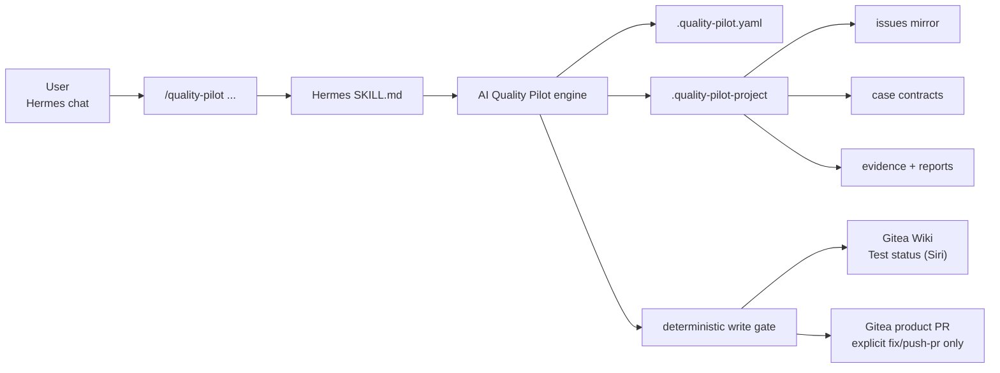
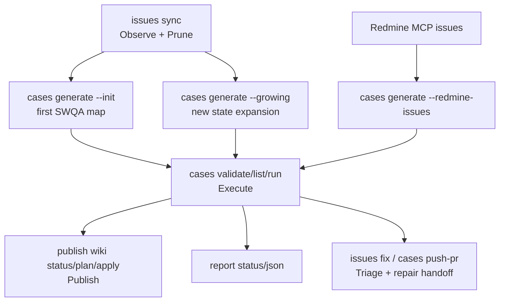

<p align="center">
  
</p>

# AI Quality Pilot


AI Quality Pilot 是給 Hermes 使用的開源 SWQA lifecycle agent/plugin。使用者在 Hermes 聊天室輸入 `/quality-pilot ...`，Hermes 依 `SKILL.md` 呼叫 deterministic AI Quality Pilot engine，完成 issue sync、test case generation、test execution、evidence/report、Wiki status sync、write gate 與產品修復 PR handoff。

English summary: AI Quality Pilot is a Hermes-first deterministic SWQA lifecycle engine for Gitea issue sync, executable test-case generation, evidence-based test execution, gated Wiki status sync, and product repair PR workflows.

## What Is AI Quality Pilot?

AI Quality Pilot 不是單純的 test runner，也不是讓 Hermes 任意拼 Gitea API 的捷徑。它把 SWQA lifecycle 收斂成少數 workflow commands：`issues`、`cases`、`publish wiki`、`close-loop`、`report`、`tracker`。

Hermes 可以協助讀 MCP、問少量問題、修 code、呈現選單；但 sync、dedupe、case contract、evidence、write gate、Wiki/PR 發布決策，都必須回到 AI Quality Pilot engine。

## Lifecycle





Closed-loop policy pack:

```text
Observe -> Normalize -> Execute -> Triage -> Publish -> Evolve -> Prune
```

## Quick Start

1. Install Hermes skill from a AI Quality Pilot checkout:

```bash
cd /root/repo/AI Quality Pilot
PYTHONPATH=/root/repo/AI Quality Pilot/src python3 -m quality_pilot.hermes install-skill --force \
  --runner-command "/usr/bin/env PYTHONPATH=/root/repo/AI Quality Pilot/src python3 -m quality_pilot.hermes"
```

2. In Hermes chat:

```text
/reload-skills
/quality-pilot help
```

3. In the product repo session:

```text
/quality-pilot setup
/quality-pilot doctor
/quality-pilot issues sync
/quality-pilot cases generate --init
/quality-pilot cases validate
/quality-pilot cases list
/quality-pilot cases run <case_id>
/quality-pilot publish wiki status
```

4. Run all cases when the first case is healthy:

```text
/quality-pilot cases run
/quality-pilot publish wiki apply
/quality-pilot report status
```

`cases generate --init` is the first-time full-repo SWQA map. It is already fast/high-standard autonomous mode: AI Quality Pilot scans README, code, package metadata, existing runners/cases/rules, then creates executable side-effect-safe probes across functional, positive, negative, boundary, invalid-input, side-effect-safe, and stress/timeout-risk dimensions. It should not ask you to approve cases one by one.

Use `--count` only when you intentionally want a smaller first batch:

```text
/quality-pilot cases generate --init --count 5
```

For follow-up expansion after issues, PRs, latest runs, or reports changed:

```text
/quality-pilot cases generate --growing
```

For Redmine issue IDs:

```text
/quality-pilot issues sync --redmine-issues 144780 144693
/quality-pilot cases generate --redmine-issues 144780 144693
```

`144780 144693` are examples only. Replace them with any Redmine issue IDs; multiple IDs are supported.

## Public Commands

```text
/quality-pilot help
/quality-pilot setup
/quality-pilot doctor

/quality-pilot issues sync
/quality-pilot issues sync --redmine-issues <redmine_issue_id> [<redmine_issue_id> ...]
/quality-pilot issues status
/quality-pilot issues show <issue_id>
/quality-pilot issues fix --all
/quality-pilot issues fix --issue <id>
/quality-pilot issues fix --issue <id> --push-pr

/quality-pilot cases generate --init
/quality-pilot cases generate --init --count 5
/quality-pilot cases generate --growing
/quality-pilot cases generate --redmine-issues <redmine_issue_id> [<redmine_issue_id> ...]
/quality-pilot cases review
/quality-pilot cases validate
/quality-pilot cases list
/quality-pilot cases run
/quality-pilot cases run <case_id>
/quality-pilot cases push-pr
/quality-pilot cases push-pr <case_id>

/quality-pilot publish wiki status
/quality-pilot publish wiki plan
/quality-pilot publish wiki apply

/quality-pilot close-loop status
/quality-pilot close-loop run-once

/quality-pilot report status
/quality-pilot report json
/quality-pilot tracker plan-write
```

`/quality-pilot help` 顯示完整中文手冊與新手路徑。子分類 help 已移除。

## Command Guide

| 你想做的事 | Command |
|---|---|
| 初始化產品 repo | `/quality-pilot setup` |
| 檢查 config、Gitea/Redmine MCP、Wiki readiness | `/quality-pilot doctor` |
| 同步 issues，內建 dedupe/prune | `/quality-pilot issues sync` |
| 從 Redmine IDs 同步本地 mirrors 並經 gate 建立 Gitea issues | `/quality-pilot issues sync --redmine-issues <redmine_issue_id> [<redmine_issue_id> ...]` |
| 看 issue sync、duplicate、fix queue、PR handoff | `/quality-pilot issues status` |
| 首次產生全 repo SWQA cases | `/quality-pilot cases generate --init` |
| 限制初始 case 數量 | `/quality-pilot cases generate --init --count 5` |
| 依最新狀態擴散 cases | `/quality-pilot cases generate --growing` |
| 從 Redmine IDs 直接產生 linked cases | `/quality-pilot cases generate --redmine-issues <redmine_issue_id> [<redmine_issue_id> ...]` |
| 驗證 case contracts | `/quality-pilot cases validate` |
| 列出 cases | `/quality-pilot cases list` |
| 跑單一 case | `/quality-pilot cases run <case_id>` |
| 跑全部 cases | `/quality-pilot cases run` |
| 查看 Wiki 狀態 | `/quality-pilot publish wiki status` |
| 產生 Wiki 草稿 | `/quality-pilot publish wiki plan` |
| 套用 Wiki 更新 | `/quality-pilot publish wiki apply` |
| 查看 closed-loop component health | `/quality-pilot close-loop status` |
| 跑一輪 closed-loop | `/quality-pilot close-loop run-once` |
| 產生報告 | `/quality-pilot report status` |

## Project Layout

```text
your-product/
  .quality-pilot.yaml
  .quality-pilot-project/
    issues/       # Gitea/Redmine local mirrors
    cases/        # YAML case contracts
    runners/      # project-owned runner scripts
    rules/        # project rules and wiki categories
    state/        # snapshots, latest-run, wiki plans
    evidence/     # stdout/stderr/rc/meta/result JSON
    reports/      # Markdown/JSON reports
```

`.quality-pilot` 是工具本體；`.quality-pilot-project` 是 host project runtime data。不要把 token、password、lab credentials、customer data 寫進 tool source 或 tracked config。

## Case Contract

最小 case YAML：

```yaml
case_id: INIT-CLI-HELP
title: CLI help returns successfully
source:
  type: init
quality_pilot:
  draft: false
  review_required_before_run: false
swqa_dimensions:
  - functional
  - positive
  - side_effect_safe
commands:
  - id: help
    run: python3 -m your_package --help
    expected_exit_code: 0
expected:
  summary: CLI help exits 0 and prints usage.
risk_controls:
  side_effect_safe: true
  requires_credentials: false
```

Every runnable case must have `commands[].run`. If a lab-only target, fixture, or credential is missing, AI Quality Pilot should still generate a safe executable probe first and record stronger lab checks as follow-up metadata.

## Reports And Evidence

Each run stores:

- stdout
- stderr
- return code
- metadata
- normalized result JSON
- contract hash

Normalized result includes:

```json
{
  "case_id": "INIT-CLI-HELP",
  "status": "PASS",
  "commands": [],
  "evidence": [],
  "contract_hash": "...",
  "started_at": "...",
  "ended_at": "...",
  "exit_code": 0
}
```

Reports live under `.quality-pilot-project/reports/`; evidence lives under `.quality-pilot-project/evidence/`.

## Wiki Status

The default Wiki page is:

```yaml
tracker:
  provider: hermes_mcp
  wiki_page: "Test status (Siri)"
```

Wiki page structure:

```text
# Test status (Siri)
## 總覽
## 測試結果明細
## <dynamic categories>
## 補充 partial probes（不併入正式 case counters）
## 活動中的 Gitea issues
## 已關閉／歷史 issues（不列 active blocker）
## 六色帽回顧
```

`publish wiki apply` is Wiki-only. It never creates issue comments, new issues, or PRs.

AI Quality Pilot does not write Gitea through its own token. `publish wiki apply` returns a gated MCP request; Hermes uses its configured Gitea MCP server to update the exact Wiki page in the same user flow, writes the MCP result JSON path requested by AI Quality Pilot, then reports the result. There is no public second completion command.

## Gitea And Redmine MCP

`/quality-pilot setup` writes MCP-only config. It does not store Gitea repo URLs, repo names, or token env names:

```yaml
tracker:
  provider: hermes_mcp
  wiki_page: "Test status (Siri)"
  mcp:
    required_servers:
      - gitea
      - redmine
    status_json: .quality-pilot-project/state/hermes-mcp/status.json
    gitea_issues_json: .quality-pilot-project/state/gitea-mcp/issues.json
    redmine_issues_json: .quality-pilot-project/state/redmine-mcp/issues.json
    wiki_write_request_json: .quality-pilot-project/state/gitea-mcp/wiki-write-request.json
    wiki_write_result_json: .quality-pilot-project/state/gitea-mcp/wiki-write-result.json
```

Hermes must expose its available MCP servers to AI Quality Pilot before `doctor` can call remote readiness ready. Either set `QUALITY_PILOT_HERMES_MCP_SERVERS=gitea,redmine` for the dispatcher process, or write `.quality-pilot-project/state/hermes-mcp/status.json` with a server list. If Gitea or Redmine MCP is missing, `/quality-pilot doctor` shows it at the beginning.

Hermes MCP usage is narrow:

- Gitea MCP may read issues before `/quality-pilot issues sync`.
- Gitea MCP may create new Gitea issues only after `/quality-pilot issues sync --redmine-issues ...` returns a gated `mcp_issue_write_request`.
- Gitea MCP may update only the configured Wiki page after `/quality-pilot publish wiki apply` returns a gated request.
- Redmine MCP may read requested issues before `/quality-pilot issues sync --redmine-issues ...` or `/quality-pilot cases generate --redmine-issues ...`.
- MCP must not create comments, edit/close/reopen issues, create PRs, write arbitrary Wiki pages, or bypass AI Quality Pilot write gate. New issue creation is allowed only through `/quality-pilot issues sync --redmine-issues ...` gated requests.

## Removed Commands

Old public groups were intentionally collapsed. If the user types an old command, Hermes must call dispatcher and show the returned `command_removed` replacement instead of silently translating and executing.

High-level replacements:

| Old concept | New command |
|---|---|
| config/status checks | `/quality-pilot doctor` |
| test listing/running | `/quality-pilot cases list`, `/quality-pilot cases run [case_id]` |
| issue dedupe | `/quality-pilot issues sync` |
| issue repair/PR | `/quality-pilot issues fix ...` |
| mixed publish | `/quality-pilot publish wiki ...` |
| Gitea sync aliases | `/quality-pilot issues sync` |
| issue-growth aliases | `/quality-pilot cases generate --growing` |

## Developer / CI Usage

From an installed package:

```bash
quality-pilot doctor --root /path/to/product
quality-pilot issues sync --root /path/to/product
quality-pilot cases generate --root /path/to/product --init
quality-pilot cases run --root /path/to/product CASE-001
quality-pilot publish wiki plan --root /path/to/product
```

From a source checkout:

```bash
PYTHONPATH=src python3 -m quality_pilot.cli doctor --root /path/to/product
PYTHONPATH=src python3 -m quality_pilot.cli cases run --root /path/to/product CASE-001
```

Run tests:

```bash
PYTHONPATH=src python3 -m unittest discover -s tests
```

## Open Source

Contributions should preserve these invariants:

- Hermes is a guided interface, not the policy owner.
- All runnable tests are case contracts.
- All evidence is persisted before status claims.
- Closed issues are remote truth and must not be reopened/commented accidentally.
- Wiki auto-sync is allowed only through the configured page and write gate.
- Product PR creation stays behind explicit `issues fix --issue <id> --push-pr` or `cases push-pr <case_id>`.
- Secrets are referenced by env var names, never stored raw.

Security issues: do not paste tokens or credentials into issues or examples. AI Quality Pilot config should reference Hermes MCP handoff paths, not tracker tokens.

License: MIT.

## FAQ

### Why does bare `/quality-pilot cases generate` not run?

Because generation has two very different meanings. Use `--init` for first-time full repo SWQA mapping, or `--growing` for follow-up expansion from latest state.

### Do I need to review every generated testcase?

No. `--init` and `--growing` should generate executable side-effect-safe probes. Hermes should only ask category-level blocking questions when AI Quality Pilot returns `hermes_needs_input`.

### Can Gitea MCP write Wiki?

Yes, but only the configured Wiki page and only after `/quality-pilot publish wiki apply` returns a gated MCP write request. For issues, Gitea MCP may create new issues only from the gated request returned by `/quality-pilot issues sync --redmine-issues ...`; it must not comment, edit, close/reopen issues, create PRs, or write arbitrary pages.

### Where do Redmine issues enter?

Hermes Redmine MCP reads requested IDs and writes snapshot JSON. Use `/quality-pilot issues sync --redmine-issues <redmine_issue_id> [<redmine_issue_id> ...]` when you want AI Quality Pilot to mirror those tickets and create gated Gitea issues. Use `/quality-pilot cases generate --redmine-issues <redmine_issue_id> [<redmine_issue_id> ...]` when you want linked testcase contracts directly; this command does not create a Gitea plan.
