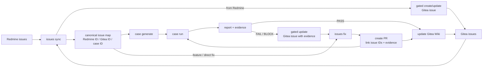

# Agent Close Loop Improvement Plan

status: proposed_for_implementation
created: 2026-06-26
source_flowchart: `/root/.codex/attachments/7f856c9d-c145-4c7b-928c-95b25884bda7/image-1.png`
scope: Redmine/Gitea issue close loop, agent module boundaries, subagent-assisted reasoning, low-human-intervention automation, and truthful QA state

## Flowchart Reading

我看得懂這張流程圖。它的核心不是單一 CLI，而是一組可拆分 agent modules 串成 close loop。修正後的資料流必須把 Gitea issue 視為輸入與輸出，而不只是最後公告出口：

Redmine 和 Gitea issues 都是問題來源。Redmine issue 經 `issues sync --redmine-issues ...` 後，會透過 gated handoff 建立或更新 linked Gitea issue；Gitea issue 也是後續協作主體。底下每個白色 box 都應該是一個可獨立執行、可觀測、可重試、可由 subagent 協助分析但不能繞過 gate 的 agent module。合在一起時，形成：

1. 讀取 Redmine/Gitea 真實問題。
2. 正規化成 canonical issue map，串起 Redmine ID、Gitea issue ID、case ID、evidence、PR。
3. 生成可執行且可信的 testcase。
4. 執行並收集 report/evidence。
5. PASS 進入 Wiki truth publication；FAIL/BLOCK 先 gated 回寫 linked Gitea issue，附 evidence/repro/context。
6. 若是新功能或明確開發需求，可從 canonical issue map 直接進入 `issues fix`，先產生 issue-driven implementation handoff。
7. 若已有 FAIL/BLOCK evidence，依 linked issue/case/evidence 產生修復或 PR handoff。
8. PR 必須關聯 Gitea issue ID、Redmine ID、case ID（若已有）、evidence path 或 acceptance verification。
9. 更新 Gitea Wiki，發布整體 truth。
10. 再從新狀態回到下一輪。

使用者可以被問問題，但只能在 agent 已完成可查明分析後，針對真的缺少的外部資訊詢問，例如帳密 env name、lab resource、fixture 選擇、不能碰的副作用邊界。不能把 repo 裡可查明的 executable、Redmine description、Gitea issue mapping、case/evidence truth 交給使用者回答。

## Current Feasibility

目前環境可以做到部分 close loop，但還不是理想流程。

| Flowchart Module | Current Entry Point | Current Capability | Can Meet Ideal Now? | Main Gap |
|---|---|---|---|---|
| Redmine source | Hermes Redmine MCP snapshot + `/quality-pilot issues sync --redmine-issues` | 可讀 live snapshot、保留 description/custom fields/journals/attachments、建立 QA summary，並 gated create/update linked Gitea issue | Partial | Dispatcher 本身仍依賴 Hermes 先寫 snapshot；attachment content、journal semantic diff、stale live-read enforcement 還不完整 |
| Gitea issue source | Hermes Gitea MCP snapshot + `/quality-pilot issues sync` | 可讀 active Gitea issues，作為 case/report/fix 的協作輸入 | Partial | Gitea issue freshness、linked Redmine reuse、writeback reconciliation 還需 module 化 |
| issues sync agent | `sync_redmine_issues`, `sync_issues`, `issues status` | 建立 local mirrors、Gitea issue create/update handoff request、dedupe、canonical traceability | Partial | 還不是獨立 state-machine agent；remote write result reconciliation、retry/idempotency、evidence writeback routing 還需要強化 |
| case generate agent | `generate_cases_from_redmine_issues`, `generate_cases_init`, `generate_cases_growing` | Redmine 可生成 linked case；init/growing 已阻止 runtime 未知時產生 placeholder cases；runtime 可自動推論 executable | Partial | 還缺真正的 subagent candidate generation/critic loop；case command diversity、oracle synthesis、fixture inference 仍偏保守 |
| case run agent | `run_case`, `cases run`, evidence store | 可執行 contract command、保存 stdout/stderr/rc/meta/result JSON | Partial | 缺 execution planner、preflight env validation、parallel/isolated runner、flaky retry、evidence-contract gate 在 run 前後的強制化 |
| issues report agent | `report status`, `issues status`, `wiki plan/status` | 可產生 status report、traceability、Wiki plan | Partial | 還沒有獨立「QA issue report」agent，把 problem/repro/evidence/fix recommendation 統一成 Gitea issue evidence update、PR、Wiki 可讀 report |
| issues fix agent | `issues fix`, `fix_issues.py` | 可 plan/run fix workflow；已支援 synced issue 無 runnable case 時走 issue-driven development handoff；PR body 可人類化 | Partial | 修復 agent 還不是多步 code-understanding loop；缺 failure classification、patch planning、post-fix retest policy、PR-to-issue linkage gate 完整化 |
| update wiki agent | `publish wiki plan/apply`, `auto_sync_wiki` | 可產生 gated Wiki update request，Hermes MCP 可套用 | Partial | Wiki readiness 仍需更強 truth source；agent 應根據 latest verified run/audit result 統一生成，不可被 stale state 污染 |
| Gitea output | Hermes Gitea MCP handoff | 可建立 issue write request、Wiki write request | Partial | Gitea issue create/update、evidence writeback、PR linkage metadata、Wiki write completion 還需 module 化與 audit 化 |
| Cross-agent orchestrator | `close-loop run-once`, Hermes skill next_actions | 有固定 pipeline 與 UX recovery | No | 還沒有圖中每個 module 的 agent contract、handoff schema、retry policy、subagent assignment、stop/go gates |

## Design Principles

- Analyze first, ask last. 每個 module 都要先查 repo、state、Redmine、Gitea、case、evidence，再問使用者。
- Ask only missing external facts. 例如 raw secret 永遠不問，只問 env var 名稱；已存在 binary 不問路徑；Redmine 已有 reproduction 不問復現步驟。
- Subagent is candidate-only. Subagent 可協助摘要、分類、生成候選 testcase/報告/修復方案，但不能直接寫 case、Gitea、Wiki、PR 或跳過 validation。
- Every module emits a contract. 輸入、輸出、confidence、missing inputs、evidence、next action 都要結構化。
- No placeholder truth. readiness probe 不能算 testcase；stale evidence 不能算 PASS；Wiki 不能比 latest verified run 更樂觀。
- Product runtime only. `commands[].run` 必須使用已設定/已推論的產品 binary/API/runner，或使用者確認的 runner；repo-only metadata probe、`python3 -c`、`compileall`、synthetic invalid command、`go test`、`go run` 不能偽裝成 testcase。
- Close loop state must be replayable. 任一 module 失敗後，下一次可以從 state/handoff/result 繼續，而不是要求使用者重講脈絡。

## Target Agent Modules

### A0: Orchestrator Agent

Purpose: 根據 flowchart 決定下一個 module，維護 close loop run id、module state、stop/go gate。

Inputs:
- Current command intent.
- `.quality-pilot-project/state/*`
- Hermes MCP readiness.
- Runtime profile status.
- State audit summary.

Outputs:
- `close-loop-session.json`
- ordered module invocations
- module gate result
- next action menu or `hermes_needs_input`

Current gap:
- `close-loop run-once` 有固定 pipeline，但沒有以圖中 modules 為單位的 resumable session。

Required changes:
- Add `state/close-loop/session.json` with module statuses.
- Add module contract schema: `quality-pilot.agent-module-result.v1`.
- Add `close-loop plan` to show which agent will run next and why.
- Stop before destructive/write modules unless gate allows.

Acceptance:
- A failed `case run` can resume at `case run` or `issues report` without rerunning `issues sync`.
- Session output lists each module as PASS/WARN/BLOCKED/SKIPPED with evidence path.

### A1: Redmine Intake Agent

Purpose: 將 Redmine issue 變成完整、可驗證、QA-focused 的 local source of truth。

Already available:
- Redmine MCP manifest path.
- Full payload preservation.
- QA summary and Gitea issue handoff.

Required changes:
- Dispatcher-level stale snapshot detector that compares requested id and `updated_on`.
- Journal/attachment summarizer handoff via subagent.
- Attachment metadata plus optional text/image OCR extraction hook.
- Redmine issue delta state: `state/redmine-mcp/issues-delta.json`.

Subagent tasks:
- `redmine_issue_summary`
- `redmine_repro_extraction`
- `redmine_risk_classifier`

Acceptance:
- If local snapshot is older than live metadata, module refuses to continue.
- QA summary includes problem, environment, reproduction, expected, actual, evidence, missing external inputs.
- No Gitea issue body contains raw JSON or tool jargon.

### A2: Issues Sync Agent

Purpose: 同步 Redmine/Gitea issue state，將 Redmine issue gated create/update 成 linked Gitea issue，並建立 canonical mapping，避免 Redmine/Gitea/Case/PR/evidence ID 混亂。

Already available:
- `issues sync`
- `issues status`
- Redmine to Gitea issue create/update handoff.
- Gitea issue snapshot input.
- State audit for stale mappings.

Required changes:
- Canonical mapping file: `state/traceability-map.json`.
- Handoff apply result reconciliation: created or updated Gitea issue ids must update traceability.
- Idempotency keys across Redmine issue create actions.
- Redmine sync must reuse/update an existing linked Gitea issue when mapping exists, not duplicate it.
- Detect active Gitea issues without runnable case before fix/report modules.
- Route later FAIL/BLOCK evidence writeback to the linked Gitea issue when mapping exists.

Subagent tasks:
- `issue_dedupe_analysis`
- `human_issue_body_review`

Acceptance:
- Redmine #X, Gitea #Y, and case `REDMINE-X` resolve to one canonical row.
- Re-running Redmine sync reuses or updates the linked Gitea issue and does not duplicate it.
- Missing runnable case becomes blocker, not hidden warning.

### A3: Case Generate Agent

Purpose: 產生真正可執行、針對問題、可被人類理解的 testcase contracts。

Already improved:
- Runtime discovery can infer existing executable such as `cmd/irctool/irctool`.
- Missing runtime no longer creates placeholder YAML.
- Repo-only readiness probe is not counted as testcase.
- Redmine developer commands such as `go test`/`go run` are rejected as QA commands.
- Gitea issue commands that do not use the configured runtime are recorded as rejected hints and replaced with a product-runtime probe instead of repo-only placeholder commands.

Remaining gaps:
- Candidate generation is still mostly deterministic, not a multi-agent SWQA reasoning loop.
- Oracle synthesis is shallow when expected/actual are noisy.
- Sibling surface and boundary matrix are generated from policy, but not deeply grounded in code paths.
- Fixture/config discovery is limited.

Required changes:
- Add case generation subagents:
  - `repo_surface_scanner`
  - `repro_command_extractor`
  - `oracle_builder`
  - `boundary_matrix_builder`
  - `case_contract_reviewer`
- Add `case-candidates.json` before writing YAML.
- Add `case generate --redmine-issues ... --plan-only`.
- Add `case contract confidence` fields:
  - `runtime_confidence`
  - `oracle_confidence`
  - `fixture_confidence`
  - `side_effect_confidence`
- Require reviewer gate before writing case when confidence is low.

Acceptance:
- No two generated cases may have identical `commands[].run` unless they intentionally share a setup preflight and differ in assertion/oracle.
- Generated Redmine cases include exact issue objective, not just binary help.
- If command cannot be made safe, output is `needs_input` with already-analyzed candidates and precise missing fields.
- Generated YAML contains no placeholder readiness probe, repo-only static check, synthetic invalid command, or developer test command.

### A4: Case Run Agent

Purpose: 執行 contract，產生可被後續 module 信任的 evidence。

Already available:
- `cases run`
- evidence files
- latest-run JSON
- status report

Required changes:
- Preflight environment validator:
  - binary exists
  - required env names present
  - fixture paths exist
  - target/resource reachability only when safe
- Evidence-contract consistency gate before writing PASS.
- Run isolation metadata:
  - cwd
  - env allowlist
  - timeout
  - contract hash
  - runtime profile hash
- Optional retry/flaky classification.

Subagent tasks:
- `failure_triage_summary`
- `evidence_interpreter`

Acceptance:
- A PASS is impossible if command id/run/hash differs from current case YAML.
- Missing env/fixture returns BLOCK, not FAIL.
- Report distinguishes product failure, environment block, tool error, and flaky result.

### A5: Issues Report Agent

Purpose: 將 run/evidence/traceability 整理成人類可讀、可協作、可修復的 report，並在 FAIL/BLOCK 時產生 linked Gitea issue evidence update payload。

Current equivalent:
- `report status`
- `issues status`
- Wiki status.

Gap:
- 沒有獨立的 `issues report` command/module，無法針對每個 active issue 生成「問題、測試、結果、下一步」報告。

Required changes:
- Add `/quality-pilot issues report`.
- Generate `reports/issues-report.md`.
- Generate `state/issues-report.json`.
- Per issue include:
  - Redmine/Gitea/case mapping
  - latest evidence
  - reproduction status
  - current blocker
  - fix readiness
  - recommended next module
- Generate gated Gitea issue update payload for FAIL/BLOCK evidence when a linked issue exists.
- Use subagent only for human wording; factual table from deterministic state.

Acceptance:
- Report can be read by a human collaborator without knowing Quality Pilot internals.
- Report never says ready when latest run/audit says blocked.
- FAIL/BLOCK evidence writeback is human-readable and targets the linked Gitea issue instead of raw JSON or a duplicate issue.
- Each active issue has exactly one next action.

### A6: Issues Fix Agent

Purpose: 從兩種入口進入修復/開發流程：一是 verified failing testcase，二是 synced issue 的新功能或直接修復需求。它會產生 patch/PR/handoff，PR 必須關聯 Gitea issue ID、Redmine ID、case ID（若已有）、evidence path 或 acceptance verification，然後回到 case run/report/wiki。

Already available:
- `issues fix`
- `submit_fix_pr`
- human-readable PR body improvements.
- Issue-driven handoff when a synced issue has no stale case mapping yet.

Gaps:
- Fix planning still mostly maps issue to existing case; it is not yet a robust code-understanding agent.
- No strict post-fix retest loop.
- No patch confidence or rollback plan.

Required changes:
- Add fix planning state:
  - `state/fix-plan.json`
  - `state/fix-attempts/<id>.json`
- Add subagents:
  - `code_localizer`
  - `fix_strategy_builder`
  - `patch_reviewer`
  - `regression_scope_expander`
- Enforce post-fix:
  - run linked failing case
  - for issue-driven development, create or confirm acceptance case coverage before PR
  - run sibling/boundary generated cases
  - update issues report
  - update wiki
- PR body must include reproduction command, evidence path, fix summary, verification, residual risk.
- PR metadata/body must include linked Gitea issue id, Redmine id when present, case id/evidence path when available, or issue-driven acceptance verification.

Acceptance:
- `issues fix --issue X` may proceed without a linked runnable case only when the synced issue has no stale/non-runnable case mapping; this is marked `issue_driven_development`.
- `issues fix --issue X --push-pr` remains blocked until acceptance cases/evidence exist.
- Every fix attempt has a retest result.
- PR creation remains gated, human-readable, and traceable back to issue/case/evidence ids.

### A7: Update Wiki Agent

Purpose: 將 close loop current truth 發布到 Gitea Wiki，不誇大、不過期、不混用 state。

Already available:
- `publish wiki plan`
- `publish wiki apply`
- auto-sync on case generation/run/write summary.

Required changes:
- Wiki truth source resolver:
  - latest verified run
  - state audit
  - issue report
  - traceability map
- Wiki readiness must show:
  - READY only when latest run and audit agree
  - BLOCKED when missing runtime/case/evidence
  - NEEDS_INPUT when user external facts are required
- Wiki update module should consume `issues-report.json`, not recompute all semantics independently.

Subagent tasks:
- `wiki_status_summary`
- `management_readiness_summary`

Acceptance:
- Wiki cannot be READY when all cases are NOT_RUN.
- Wiki page includes last run id, audit status, issue coverage, blockers, next module.
- Gitea MCP write request is Wiki-only and replayable.

### A8: Gitea Output Agent

Purpose: 負責所有 Gitea remote write handoff，包括 Redmine issue create/update、FAIL/BLOCK evidence writeback、PR linkage metadata、Wiki update、未來 comment policy。

Already available:
- Gitea MCP issue create request.
- Gitea MCP Wiki write request.

Gaps:
- Gitea result reconciliation is still split across state files.
- No unified remote write ledger.

Required changes:
- Add `state/gitea-mcp/write-ledger.json`.
- Every remote write request/result pair gets:
  - operation id
  - target type
  - idempotency key
  - created/updated remote id
  - source module
  - gate result
- Add target-specific write types: `issue_create`, `issue_update`, `issue_evidence_update`, `pr_linkage`, `wiki_update`.
- Add `gitea output status`.

Acceptance:
- A completed Gitea write is never re-applied as a duplicate.
- Traceability map updates after successful issue create/update.
- Evidence writeback updates the linked Gitea issue when mapping exists.
- PR linkage metadata records Gitea issue id, Redmine id when present, case id/evidence path when available, or issue-driven acceptance verification.
- Wiki apply result links back to exact plan hash.

## Subagent Operating Model

Subagents should be used aggressively, but only for bounded candidate work.

| Subagent Role | Used By Module | Input | Output | Must Not Do |
|---|---|---|---|---|
| Redmine summarizer | A1 | Redmine full payload | QA summary candidate | Write Gitea/Wiki |
| Repro extractor | A1/A3 | Description, journals, attachments | command/steps candidates | Invent missing commands |
| Repo surface scanner | A3 | repo inventory/runtime profile | surface map | Write YAML |
| Oracle builder | A3 | expected/actual/evidence | oracle candidate | Claim PASS |
| Boundary matrix builder | A3 | bug pattern + code/repro signals | SWQA matrix | Execute commands |
| Case reviewer | A3 | case candidate | confidence/gaps | Approve unsafe command |
| Evidence interpreter | A4/A5 | stdout/stderr/rc/meta | failure classification | Change result |
| Issue report writer | A5 | deterministic issue report JSON | human wording | Change facts |
| Code localizer | A6 | synced issue plus case/evidence when available | suspicious files/functions | Patch directly |
| Fix strategy builder | A6 | localization + evidence | patch plan candidate | Push PR |
| Wiki summarizer | A7 | issue report + run/audit | summary paragraph | Mark READY |

Subagent config is currently available through `/quality-pilot subagent status/configure`, but the implementation still needs task-level prompt/version tracking and result persistence for every subagent call.

## Phased Implementation Roadmap

### CL0: Stabilize First-Run Truth

Status: partially implemented in current checkout.

Tasks:
- CL0-01 Infer runtime executable from repo before asking user.
- CL0-02 Do not generate placeholder cases when runtime is unknown.
- CL0-03 Make clarify prompts bullet-listed and analysis-first.
- CL0-04 Prevent Wiki auto-sync when case generation returns `needs_input`.
- CL0-05 Add smoke tests for clean repo with executable and clean repo without executable.

Acceptance:
- Clean repo with `cmd/tool/tool` generates cases without asking for binary.
- Clean repo without executable returns `needs_input`, `generated_count: 0`, and writes no case YAML.

### CL1: Module Contracts And Session State

Tasks:
- CL1-01 Add module result schema.
- CL1-02 Add `close-loop plan`.
- CL1-03 Add `close-loop session.json`.
- CL1-04 Make every module write result path and next module.
- CL1-05 Add resume command.

Acceptance:
- A close loop can be stopped after any module and resumed without losing state.

### CL2: Redmine And Issue Sync Hardening

Tasks:
- CL2-01 Live-read freshness enforcement in dispatcher payload validation.
- CL2-02 Redmine delta state.
- CL2-03 Attachment/journal semantic handoff.
- CL2-04 Traceability map.
- CL2-05 Remote write ledger for Gitea issue create/update and evidence writeback.

Acceptance:
- Redmine/Gitea/case mapping is deterministic and duplicate-safe; Redmine sync reuses linked Gitea issues when possible.

### CL3: Case Generation Agent Upgrade

Tasks:
- CL3-01 Add candidate JSON stage.
- CL3-02 Add subagent-assisted repro extraction.
- CL3-03 Add oracle/boundary/sibling-surface builders.
- CL3-04 Add confidence fields.
- CL3-05 Add reviewer gate for low-confidence or unsafe candidates.
- CL3-06 Add command uniqueness/deduplication rule.

Acceptance:
- Generated cases are issue-specific, executable, and non-duplicative.

### CL4: Execution And Evidence Gate

Tasks:
- CL4-01 Runtime preflight.
- CL4-02 Env/fixture/target BLOCK classification.
- CL4-03 Evidence-contract hash gate.
- CL4-04 Run isolation metadata.
- CL4-05 Flaky retry classification.

Acceptance:
- PASS means current contract truly passed under recorded runtime profile.

### CL5: Issues Report Agent

Tasks:
- CL5-01 Add `/quality-pilot issues report`.
- CL5-02 Add `issues-report.json`.
- CL5-03 Add human markdown report.
- CL5-04 Add subagent wording candidate.
- CL5-05 Add per-issue next action and gated Gitea issue evidence update payload for FAIL/BLOCK.

Acceptance:
- Human collaborator can reproduce current state and next step from report alone; FAIL/BLOCK writeback is human-readable and targets the linked Gitea issue.

### CL6: Fix Agent And Retest Loop

Tasks:
- CL6-01 Support two fix entry modes: verified failing/blocking case and synced issue-driven feature/fix handoff.
- CL6-02 Add code localization subagent.
- CL6-03 Add patch plan state.
- CL6-04 Add post-fix retest gate.
- CL6-05 Add PR body truth gate with Gitea issue id, Redmine id when present, case id/evidence path when available, or issue-driven acceptance verification.

Acceptance:
- `issues fix` can start immediately after `issues sync` for new feature/development issues when no stale case mapping exists.
- `--push-pr` remains blocked until acceptance coverage/evidence exists.
- Fix workflow always returns to `case run` before report/wiki ready state, and every PR remains traceable to issue/case/evidence ids.

### CL7: Wiki And Gitea Output Truth

Tasks:
- CL7-01 Wiki consumes issue report/audit/latest verified run.
- CL7-02 Add write ledger.
- CL7-03 Add Wiki stale-source banner.
- CL7-04 Add Gitea issue/Wiki apply reconciliation.
- CL7-05 Add management summary subagent.

Acceptance:
- Wiki cannot overstate readiness or duplicate remote writes; it reflects issue evidence writeback and PR linkage state.

### CL8: Full Autonomous Close Loop

Tasks:
- CL8-01 Add `/quality-pilot close-loop run --redmine-issues ...`.
- CL8-02 Add module stop/go policy.
- CL8-03 Add minimal human-intervention mode.
- CL8-04 Add dry-run simulation.
- CL8-05 Add end-to-end fixture test with fake Redmine/Gitea/MCP.

Acceptance:
- One command can run a Redmine or Gitea issue through sync, canonical mapping, either issue-driven fix handoff or case generation, safe execution, report/evidence, linked Gitea issue writeback, fix/PR readiness, and Wiki publication, stopping only for missing external facts or gated writes.

## Current Environment Readiness Checklist

| Requirement | Current Evidence | Status |
|---|---|---|
| Hermes MCP status can be surfaced | `doctor`, `hermes_mcp.py` | Partial |
| Redmine live full payload can be consumed | `redmine.py`, Hermes skill rule | Partial |
| Gitea issue/Wiki writes are gated | `write_gate.py`, `wiki.py`, Gitea MCP request files | Partial |
| Runtime can be inferred before asking user | `runtime_profile.py` | Mostly ready |
| Placeholder cases are blocked | `generate_cases_init/growing` runtime gate | Ready for init/growing |
| Redmine case generation avoids developer commands | `case_generation.py`, tests | Mostly ready |
| Subagent can be configured | `subagents.py` | Partial |
| Subagent task results are persisted | missing task result store | Not ready |
| Independent agent module state exists | no module result schema/session | Not ready |
| Issues report agent exists | no `/quality-pilot issues report` | Not ready |
| Full close loop one-command flow exists | `close-loop run-once` is pipeline-like but not flowchart-module aware | Not ready |

## Test Plan

Regression tests to add or keep:

- Clean repo with executable:
  - setup infers runtime.
  - cases generate writes executable cases without asking entrypoint.
- Clean repo without executable:
  - cases generate returns `needs_input`.
  - no placeholder YAML written.
  - clarify prompt is bullet-listed and lists analyzed surfaces.
- Gitea issue with developer command:
  - issue command is recorded as rejected hint.
  - generated case uses configured/inferred product runtime instead.
  - no repo-only, `python3 -c`, `compileall`, `go test`, `go run`, or synthetic invalid command is written.
- Redmine issue with full reproduction:
  - case generation extracts command and uses inferred runtime.
  - developer commands are rejected as implementation hints.
- Duplicate command prevention:
  - generated cases may not all share identical command unless they are a named shared preflight.
- Evidence truth:
  - stale evidence hash mismatch blocks PASS.
- Issues report:
  - active issue with no runnable case is blocker.
  - report includes Redmine/Gitea/case/evidence mapping.
  - FAIL/BLOCK evidence produces a human-readable linked Gitea issue update payload.
- PR linkage:
  - fix handoff includes Gitea issue id, Redmine id when present, and case/evidence or acceptance verification state.
  - issue-driven handoff after sync succeeds without a linked case, but `--push-pr` blocks until verification coverage exists.
- Wiki truth:
  - READY impossible when audit blocked or cases NOT_RUN.
- End-to-end fake close loop:
  - Redmine fixture -> sync -> Gitea issue create/update -> generate -> run -> report -> linked issue evidence update -> fix/PR handoff -> gated Wiki request.

## Definition Of Done

The ideal flowchart is achieved when:

1. Each flowchart box has an explicit agent module contract.
2. Each module can run independently and emit resumable state.
3. The orchestrator can chain modules without asking the user for facts that repo/Redmine/Gitea/state can prove.
4. Any user question is preceded by structured analysis and asks only for missing external facts.
5. Subagents assist candidate reasoning for summaries, testcase design, report wording, and fix strategy, but all writes pass deterministic validation.
6. Case generation never creates fake executable coverage.
7. PASS/Wiki/Gitea state can be traced back to current case contract and evidence.
8. The complete Redmine-to-Gitea loop can run in dry-run and real gated modes.
